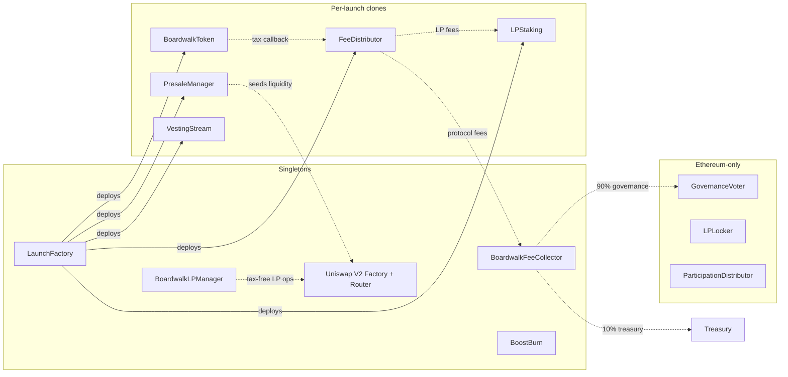

# Boardwalk Launchpad

Permissionless token launch protocol with embedded transfer tax, time-weighted presale, permanently burned liquidity, LP staking, community ranking, and (on Ethereum) onchain governance over protocol revenue.

Deployed on Ethereum, Base, Arbitrum, and Robinhood Chain, with canonical Uniswap V2 as the underlying DEX on every chain. The protocol token is BWLK (fixed 3.15M supply), which replaces BMX via a 1:1 migration; Ethereum mainnet is its economic home. Membership NFTs bridge between chains via Chainlink CCIP, and source-chain protocol revenue is consolidated to Ethereum.

See [SPEC.md](SPEC.md) for the full spec.

## Architecture

Each launch deploys 4–5 [EIP-1167](https://eips.ethereum.org/EIPS/eip-1167) clones from shared implementation templates. Singletons are deployed once per chain.



## Repository layout

```
src/
  base/
    Timelocked.sol          signal/execute/burn + auth hooks (7d default, 21d for governance)
    AllocationLib.sol       shared token allocation math
    MembershipDiscount.sol  NFT membership check + BPS discount helpers
  core/
    LaunchFactory.sol       clone deployment and admin config
    BoardwalkToken.sol      ERC20 with embedded tax
    FeeDistributor.sol      tax routing to 5 destinations
    PresaleManager.sol      contributions, seeding, claims, refunds
    LPStaking.sol           staking with vesting + fee epochs + MP
    VestingStream.sol       linear vesting with 7-day cliff
    BoardwalkLPManager.sol  tax-exempt LP wrapper (RAISE_TOKEN pairs only)
    BoardwalkFeeCollector.sol protocol fee aggregation + 10/90 governance split
    IntegratorFeeCollector.sol per-chain protocol singleton with frozen integrator slots, 25%/24h rate-limited claims
    BoostBurn.sol           community token ranking via protocol-token burn
  token/                     BWLK + the BMX→BWLK migration (Ethereum mainnet)
    BWLK.sol                fixed-supply protocol token, no minter/owner
    BwlkMigration.sol       1:1 migration: burns BMX, stakes BWLK, credits voter points
    UnsoldBurner.sol        CCA launch unsold-token sink; BWLK only ever moves to dead
  governance/                Ethereum only
    GovernanceVoter.sol     weekly voting + execution + vault
    LPLocker.sol            permanent Uniswap v4 LP lock with fee harvest
    ParticipationDistributor.sol 7-day BWLK streaming for Option 4
  nft/                       cross-chain membership NFT (Chainlink CCIP bridge)
    BoardwalkClub.sol       (deprecated) soulbound membership NFT; superseded by BoardwalkClubMirror
    BoardwalkClubBridgeBase.sol shared CCIP send/receive plumbing
    BoardwalkClubLockbox.sol Base side: lock/release of the original collection
    BoardwalkClubMirror.sol  spoke side: burn/mint transferable mirror
  crosschain/                weekly consolidation of source-chain revenue to Ethereum
    RevenueBridger.sol      source lanes (Base/Arbitrum/Robinhood): forward revenue via LiFi (pure Across V4)
    EthereumRevenueSwapper.sol hub: swap delivered tokens to WETH, forward to the FeeCollector
  interfaces/                cross-contract interfaces
test/                        unit, fuzz, invariant, fork
script/                      deployment scripts (script/bwlk/ = the Ethereum BWLK deployment + CCA launch)
snapshot/                    off-chain merkle pipeline for the migration's voter-point snapshot (TS)
```

## Build and test

```bash
forge build
forge test
forge coverage --ir-minimum --skip "script/*" --report summary
forge fmt src/base/ src/core/ src/interfaces/ src/governance/ src/nft/ src/crosschain/
forge lint src/base/ src/core/ src/interfaces/ src/governance/ src/nft/ src/crosschain/
```

## Deployment

The underlying DEX is the canonical Uniswap V2 deployment on each chain ([script/DexConfig.sol](script/DexConfig.sol)); nothing DEX-side is deployed by Boardwalk.

```bash
forge script script/02_DeployFactory.s.sol --rpc-url $RPC_URL --broadcast          # full per-chain launchpad stack
forge script script/04_DeployNFTBridge.s.sol --rpc-url $RPC_URL --broadcast        # mirror on a new spoke (lockbox already live on Base)
forge script script/05_AddLockboxPeer.s.sol --rpc-url $BASE_RPC --broadcast        # wire the new spoke: SET_PEER signal, then execute after 7d
forge script script/06_DeployRevenueBridging.s.sol --rpc-url $RPC_URL --broadcast  # Ethereum swapper first, then each source lane
```

BWLK deployment (Ethereum mainnet, in this order; script `06` prints the post-launch steps — migrate, hook commit, position registration, unsold burn):

```bash
forge script script/bwlk/01_DeployBWLK.s.sol --rpc-url $ETH_RPC --broadcast           # token + genesis buckets
forge script script/bwlk/02_DeployBwlkGovernance.s.sol --rpc-url $ETH_RPC --broadcast # voter + locker + distributor
forge script script/bwlk/05_DeployUnsoldBurner.s.sol --rpc-url $ETH_RPC --broadcast  # before the CCA launch
forge script script/bwlk/06_LaunchBwlkCca.s.sol --rpc-url $ETH_RPC --broadcast        # the CCA launch (LiquidityLauncher, never the raw factory)
forge script script/bwlk/03_DeployBwlkMigration.s.sol --rpc-url $ETH_RPC --broadcast  # root before funding
forge script script/bwlk/04_AssertBwlkDeploy.s.sol --rpc-url $ETH_RPC                 # go-live gate, reverts on any mis-wiring
```

The migration's merkle root comes from the `snapshot/` pipeline (`npm run snapshot && npm run validate`).

## Audits

Reports land in `./audits/` once available.

## License

[BUSL-1.1](LICENSE), converts to MIT on 2030-02-13.
