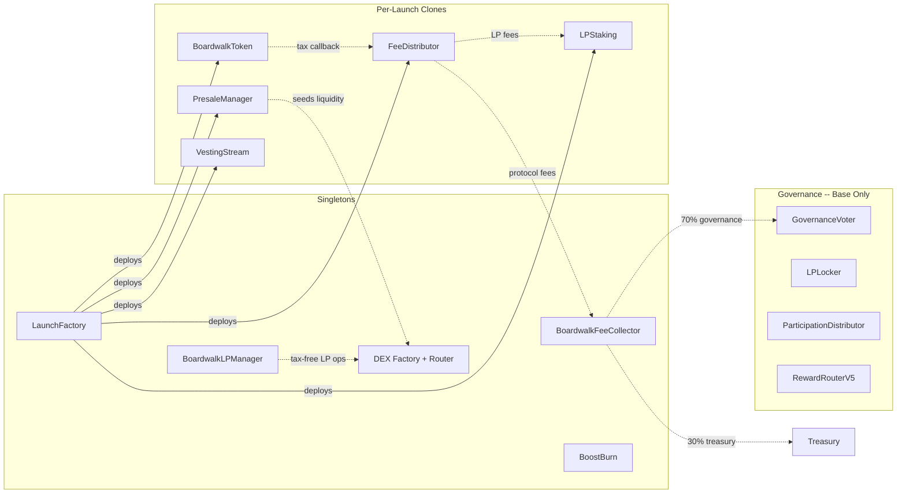
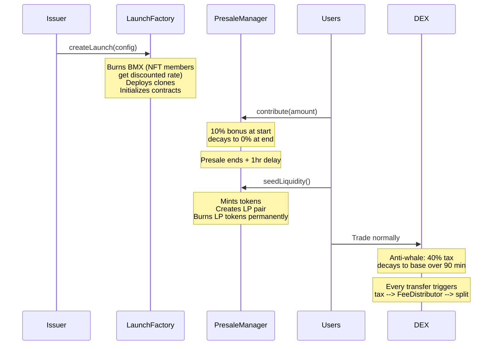
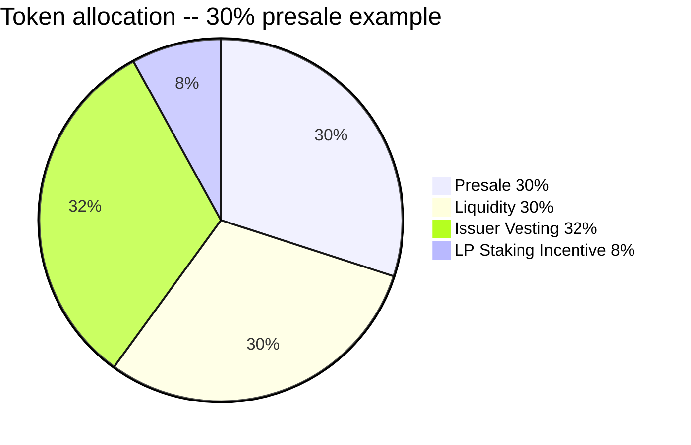
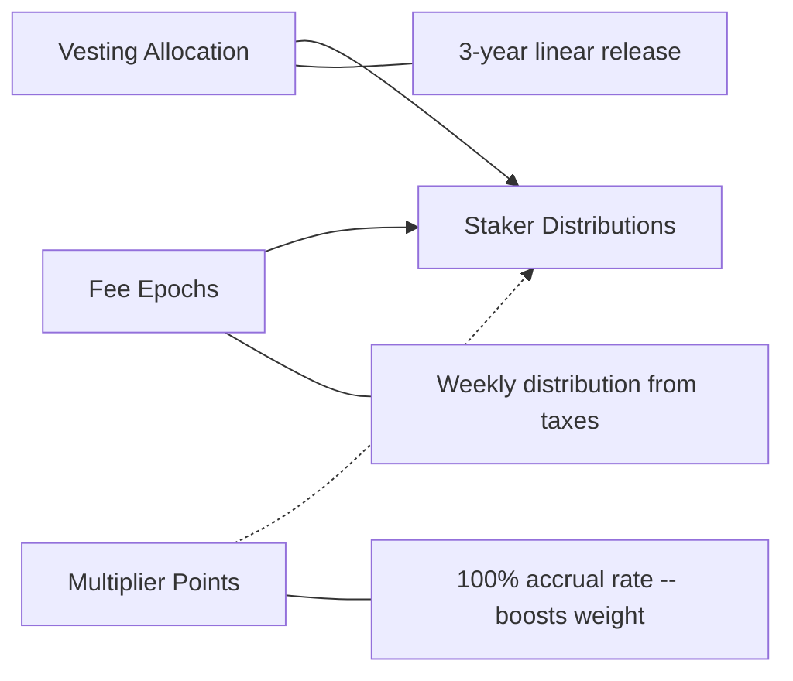
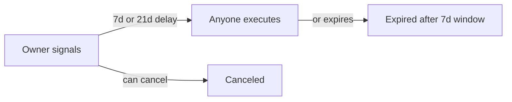

# Boardwalk Launchpad

Permissionless token launch protocol with embedded transfer taxes, time-weighted presales, permanent liquidity, LP staking, community token ranking, and onchain governance.

## Architecture

The system consists of **singleton contracts** deployed once per chain and **clone sets** deployed per token launch. Singletons handle shared infrastructure (DEX, LP management, protocol fees, governance). Each launch creates 4–5 lightweight EIP-1167 proxy clones that handle that token's lifecycle: presale, tax distribution, staking, and vesting.



Each launch deploys 4-5 [EIP-1167 minimal proxy clones](https://eips.ethereum.org/EIPS/eip-1167) from implementation templates. Solid arrows = deployment, dotted arrows = runtime interactions.

## Launch lifecycle



## Launch paths

|  | EXPRESS | ADVANCED |
|:--|:--------|:----------|
| Presale duration | 24 hours | 2-14 days (default 7d) |
| Presale allocation | Fixed 50% | 25-50% (divisible by 5%) |
| Start delay | Immediate | 24 hours |
| Vesting | Not available | Up to 5 recipients (required if presale < 50%; referrer can be included) |
| Referrer | Not available | Optional |
| Fee recipients | 1 | Up to 4 |

## Token allocation

Total supply is fixed at **10 billion tokens** for every launch.



| Bucket | Formula | 30% Example |
|:-------|:--------|------------:|
| Presale | `supply * presalePercent / 10000` | 3.0B |
| Liquidity | Same as presale | 3.0B |
| LP staking incentive | `remainder * 20%` | 0.8B |
| Issuer vesting | `remainder - LP incentive` | 3.2B |

Presale and liquidity are always equal. LP tokens are burned to `0xdead` for permanent liquidity.

## Fee flow

Every non-exempt transfer pays a **1.15% tax** (115 BPS), split differently depending on the factory deployment mode. Actual amounts depend on transfer volume and may be zero:

**Boardwalk-only mode:**
| Recipient | BPS | Note |
|:----------|:----|:-----|
| Issuer | 40 | Claimable with 10%/24h rate limit |
| Protocol | 45 | Swapped to raise token by keeper |
| LP Staking | 30 | Weekly epoch distributions |
| Referrer | 5 | Carved from protocol share |

**Integrator mode** (separate factory deployment):
| Recipient | BPS | Note |
|:----------|:----|:-----|
| Issuer | 35 | Same claim mechanics |
| Protocol | 30 | Same swap mechanics |
| LP Staking | 25 | Same epoch mechanics |
| Integrator | 25 | Claims in native token, no rate limit |

On Base, the protocol share is further split: **30% to treasury, 70% to GovernanceVoter** for weekly governance-directed allocation. Allocation amounts depend on actual protocol activity, volume, and onchain conditions, and may be zero. Votes in epoch N decide epoch N+1: `finalize(N)` reads epoch N-1 votes, and epoch 0 defaults to treasury. Governance peers (`lpLocker`, `participationDistributor`) are wired once via `initializePeers()` after deployment. Finalization is sequential (`N-1` must be finalized and executed before `N`). `finalize()` and `execute()` both require keeper or owner. Per-epoch budget accounting uses `accountedBudget` so finalized-but-not-executed funds are not double-counted; `forceMarkExecuted()` (permissionless after 14 days) decrements this accounting and routes stuck budgets to a separate fallback treasury (21-day timelocked setter). Finalization re-validates voter sbfBMX balances in batches and temporarily disables staking via `RewardRouterV5` during the tally. All owner-controlled timelocked actions can be permanently burned via per-action burn (timelocked, irreversible).

## LP Staking

Stakers receive distributions from two sources:



Multiplier points accrue at a fixed onchain rate of 1 MP per LP token per year, increasing effective weight without additional capital. MP burns proportionally on withdrawal. Distribution amounts depend on actual protocol activity and may be zero.

## Project structure

```
src/
  base/
    Timelocked.sol              -- Generic signalAction/cancelAction/burn with auth hooks (7d or 21d)
    AllocationLib.sol            -- Shared token allocation math (presale/liquidity/incentive/vesting splits)
    MembershipDiscount.sol       -- Shared NFT membership check + BPS discount helpers
  core/
    LaunchFactory.sol           -- Clone deployment + admin config + integrator support + NFT member discount
    BoardwalkToken.sol          -- ERC20 with universal tax + anti-whale decay
    FeeDistributor.sol          -- Tax routing to 5 destinations (incl. integrator)
    PresaleManager.sol          -- Contributions, seeding, claims, refunds
    LPStaking.sol               -- LP staking with vesting + fee epochs + MP
    VestingStream.sol           -- Linear vesting with 7-day cliff + issuer-timelocked recipient changes
    BoardwalkLPManager.sol      -- Tax-exempt LP add/remove wrapper (RAISE_TOKEN pairs only)
    BoardwalkFeeCollector.sol   -- Protocol fee aggregation + 30/70 governance split
    BoostBurn.sol               -- Community token ranking via BMX burn + NFT member discount
  governance/
    GovernanceVoter.sol         -- Weekly voting + batched finalization + advance-vote execution (keeper/owner, Base only)
    LPLocker.sol                -- Permanent Uniswap v4 LP position lock + direct PositionManager fee harvest
    ParticipationDistributor.sol -- 7-day linear BMX streaming for vote option 4
  interfaces/                   -- Minimal interfaces for cross-contract calls
  dex/                          -- Forked Uniswap V2 (0.1% pair fee)
```

## Admin controls

Admin parameters use a **7-day timelock** with 7-day expiry window. Governance parameters use a **21-day timelock** (same expiry). All timelocked actions go through a single generic `signalAction(action, dataHash)` / `cancelAction(action)` API on `Timelocked.sol`, with per-contract auth hooks (`_authAdmin`) and delay hooks (`_actionDelay`). Any timelocked action can be permanently burned via `signalBurnAction` / `executeBurnAction`.



| Parameter | Delay | Constraints |
|:----------|:------|:-----------|
| BMX burn amount | 7d | 0-200 BMX (action can be permanently burned) |
| NFT collection (factory) | 7d | address(0) disables membership discounts |
| Member launch discount | 7d | 0-10000 BPS (2500 = 25% off at deployment) |
| NFT collection (BoostBurn) | 7d | address(0) disables membership discounts |
| Member boost discount | 7d | 0-10000 BPS (10000 = free at deployment) |
| Fee defaults | 7d | issuer 10-80, boardwalk 10-50, incentive 0-50, referrer 0-10, integrator 0-50 BPS |
| Presale range | 7d | 500-5000 BPS, divisible by 500 |
| Graduation thresholds | 7d | Set per chain at deployment |
| Presale durations | 7d | Express > 0; Advanced 2-14 days |
| Fee collector | 7d | Address for future launches |
| Integrator address | 7d | Address for future launches (factory-level) |
| Governance vault | 7d | GovernanceVoter address on Base |
| Governance treasury | 7d | Non-zero address, receives Option 1 / dust funds |
| Governance burn | 21d | 0-1 BMX per vote (starts at 0) |
| Fallback treasury | 21d | Receives forced-execution funds, non-zero address |
| Governance keeper | 7d | Non-zero address |

Fee percentages are frozen per-launch at deployment. Issuer/referrer addresses can change post-launch via per-recipient 7-day timelocks on FeeDistributor. Vesting recipient addresses can change post-launch via issuer-controlled 7-day timelocks on VestingStream (vesting amounts and schedule remain immutable). Integrator address is permanent per-launch.

## Development

```bash
# Build
forge build

# Test
forge test

# Coverage (excludes DEX fork and deploy scripts)
forge coverage --ir-minimum --skip "*/dex/*" --skip "script/*" --report summary

# Format + lint (boardwalk contracts only)
forge fmt src/base/ src/core/ src/interfaces/ src/governance/
forge lint src/base/ src/core/ src/interfaces/ src/governance/

# Deploy (per chain)
forge script script/01_DeployDEX.s.sol --rpc-url $RPC_URL --broadcast
forge script script/02_DeployFactory.s.sol --rpc-url $RPC_URL --broadcast
forge script script/03_DeployGovernance.s.sol --rpc-url $RPC_URL --broadcast  # Base only
forge script script/04_DeployBoostBurn.s.sol --rpc-url $RPC_URL --broadcast   # Base only
```

## Testing

- Unit, fuzz, invariant, and integration test suites
- Static analysis with Slither and Aderyn
- Coverage-guided fuzzing with Medusa

## Documentation

See [UNIFIED_SUMMARY.md](UNIFIED_SUMMARY.md) for the complete technical specification including all functions, state variables, cross-contract flows, and invariants.

## License

[BUSL-1.1](LICENSE) -- converts to MIT on February 13, 2030.

DEX fork (`src/dex/`) retains its original license.
