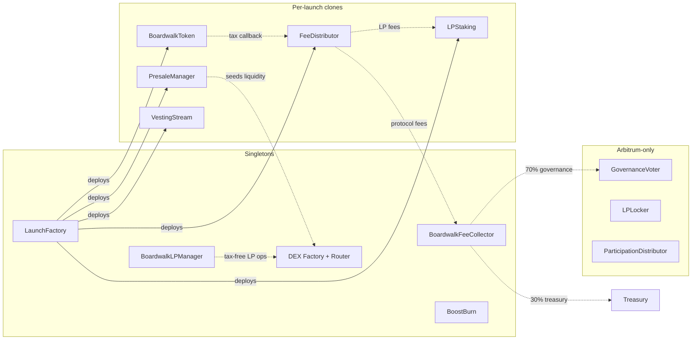

# Boardwalk Launchpad

Permissionless token launch protocol with embedded transfer tax, time-weighted presale, permanently burned liquidity, LP staking, community ranking, and (on Arbitrum) onchain governance over protocol revenue.

Deployed across Ethereum, Base, Arbitrum, Ink, Katana, and Fraxtal. The protocol token is BWS (fixed 3.15M supply), which replaced BMX via a 1:1 migration; governance and the revenue hub moved from Base to Arbitrum with it. Membership NFTs bridge between chains via Chainlink CCIP, and source-chain protocol revenue is consolidated to the hub.

See [SPEC.md](SPEC.md) for the full spec, including the *BWS token and migration* section.

## Architecture

Each launch deploys 4–5 [EIP-1167](https://eips.ethereum.org/EIPS/eip-1167) clones from shared implementation templates. Singletons are deployed once per chain.



## Repository layout

```
src/
  base/
    Timelocked.sol          signal/execute/burn + auth hooks (7d default, 21d for governance)
    AllocationLib.sol       shared token allocation math
    MembershipDiscount.sol  NFT membership check + BPS discount helpers
  core/
    LaunchFactory.sol       clone deployment and admin config
    BoardwalkToken.sol      ERC20 with embedded tax
    FeeDistributor.sol      tax routing to 5 destinations
    PresaleManager.sol      contributions, seeding, claims, refunds
    LPStaking.sol           staking with vesting + fee epochs + MP
    VestingStream.sol       linear vesting with 7-day cliff
    BoardwalkLPManager.sol  tax-exempt LP wrapper (RAISE_TOKEN pairs only)
    BoardwalkFeeCollector.sol protocol fee aggregation + 30/70 governance split
    IntegratorFeeCollector.sol per-chain protocol singleton with frozen integrator slots, 25%/24h rate-limited claims
    BoostBurn.sol           community token ranking via BWS burn
  token/                     BWS + the BMX→BWS migration (Arbitrum only)
    BWS.sol                 fixed-supply protocol token, no minter/owner
    BwsMigration.sol        1:1 migration: burns BMX, stakes BWS, credits voter points
    UnsoldBurner.sol        CCA launch unsold-token sink; BWS only ever moves to dead
  governance/                Arbitrum only
    GovernanceVoter.sol     weekly voting + execution + vault
    LPLocker.sol            permanent Uniswap v4 LP lock with fee harvest
    ParticipationDistributor.sol 7-day BWS streaming for Option 4
  nft/                       cross-chain membership NFT (Chainlink CCIP bridge)
    BoardwalkClub.sol       (deprecated) soulbound membership NFT; superseded by BoardwalkClubMirror
    BoardwalkClubBridgeBase.sol shared CCIP send/receive plumbing
    BoardwalkClubLockbox.sol Base side: lock/release of the original collection
    BoardwalkClubMirror.sol  spoke side: burn/mint transferable mirror
  crosschain/                weekly consolidation of source-chain revenue to the hub
    RevenueBridger.sol      source lanes: forward revenue to the hub via LiFi (Across/Symbiosis/Glacis)
    BaseRevenueSwapper.sol  hub: swap delivered tokens to WETH, forward to the FeeCollector
  interfaces/                cross-contract interfaces
  dex/                       forked Uniswap V2 (0.1% pair fee)
test/                        unit, fuzz, invariant, fork
script/                      deployment scripts (script/bws/ = the Arbitrum BWS deployment + CCA launch)
snapshot/                    off-chain merkle pipeline for the migration's voter-point snapshot (TS)
```

## Build and test

```bash
forge build
forge test
forge coverage --ir-minimum --skip "*/dex/*" --skip "script/*" --report summary
forge fmt src/base/ src/core/ src/interfaces/ src/governance/ src/nft/ src/crosschain/
forge lint src/base/ src/core/ src/interfaces/ src/governance/ src/nft/ src/crosschain/
```

## Deployment

```bash
forge script script/01_DeployDEX.s.sol --rpc-url $RPC_URL --broadcast
forge script script/02_DeployFactory.s.sol --rpc-url $RPC_URL --broadcast
forge script script/03_DeployGovernance.s.sol --rpc-url $RPC_URL --broadcast       # legacy Base governance; Arbitrum uses script/bws/02
forge script script/04_DeployNFTBridge.s.sol --rpc-url $RPC_URL --broadcast        # Base lockbox + spoke mirrors
forge script script/05_WireLockboxPeers.s.sol --rpc-url $RPC_URL --broadcast       # one-shot CCIP peer wiring
forge script script/06_DeployRevenueBridging.s.sol --rpc-url $RPC_URL --broadcast  # hub swapper first, then each lane
```

BWS migration (Arbitrum, in this order; script `06` prints the post-launch steps — migrate, hook commit, position registration, unsold burn):

```bash
forge script script/bws/01_DeployBWS.s.sol --rpc-url $ARB_RPC --broadcast           # token + genesis buckets
forge script script/bws/02_DeployBwsGovernance.s.sol --rpc-url $ARB_RPC --broadcast # voter + locker + distributor
forge script script/bws/05_DeployUnsoldBurner.s.sol --rpc-url $ARB_RPC --broadcast  # before the CCA launch
forge script script/bws/06_LaunchBwsCca.s.sol --rpc-url $ARB_RPC --broadcast        # the CCA launch (LiquidityLauncher, never the raw factory)
forge script script/bws/03_DeployBwsMigration.s.sol --rpc-url $ARB_RPC --broadcast  # root before funding
forge script script/bws/04_AssertBwsDeploy.s.sol --rpc-url $ARB_RPC                 # go-live gate, reverts on any mis-wiring
```

The migration's merkle root comes from the `snapshot/` pipeline (`npm run snapshot && npm run validate`).

## Audits

Reports land in `./audits/` once available.

## License

[BUSL-1.1](LICENSE), converts to MIT on 2030-02-13. The `src/dex/` fork retains its upstream license.
