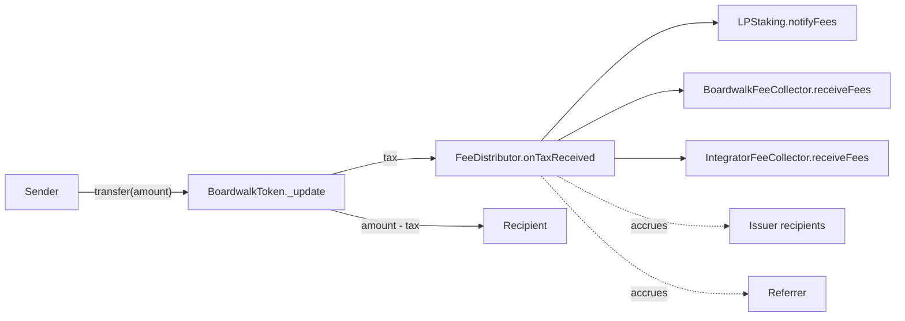

# Boardwalk Launchpad: Technical Spec

A permissionless token launch protocol. Each launch deploys 4–5 EIP-1167 clones from shared implementation templates; singletons are deployed once per chain. Launches feature an embedded transfer tax, time-weighted presale, permanently locked liquidity, LP staking with multiplier points, and (on Base) onchain governance over protocol revenue.

Targeted chains: Ethereum, Base, Katana, Fraxtal, Ink. The raise token (WETH, frxUSD, etc.) is set per chain at deployment.

---

## Architecture

**Per-launch clones** (deployed by `LaunchFactory.createLaunch`):
- `BoardwalkToken`: ERC20 with embedded tax
- `FeeDistributor`: splits tax across recipients
- `PresaleManager`: contributions, seeding, claims, refunds
- `LPStaking`: staking with vesting, fee epochs, multiplier points
- `VestingStream`: linear vesting (Advanced path only when `presalePercent < 50%`)

**Singletons** (deployed once per chain):
- `LaunchFactory`, `BoardwalkLPManager`, `BoardwalkFeeCollector`, `IntegratorFeeCollector`, `BoostBurn`
- Base only: `GovernanceVoter`, `LPLocker`, `ParticipationDistributor`

Each clone is initialised exactly once. `LPStaking` and `VestingStream` use a two-step `setInitializer` → `initialize` lock so only `PresaleManager` can initialise them at seed time; the rest use OZ `Initializable`. Express launches deploy 4 clones (no `VestingStream`); Advanced launches deploy 5 when `presalePercent < 50%`, otherwise 4.

The per-transfer tax fan-out is the central flow. Sender pays `tax`; the rest goes to the destination:



The LP, boardwalk, and integrator forwards are wrapped in `try/catch` so a downstream revert never bricks the transfer. Issuer and referrer shares accrue for pull-based claims.

---

## Launch paths

|                       | EXPRESS                         | ADVANCED                                                    |
| --------------------- | ------------------------------- | ----------------------------------------------------------- |
| Presale duration      | 24h (configurable, > 0)         | 7d default (admin range 2–14d)                              |
| Presale allocation    | Fixed 50%                       | 25–50%, divisible by 5%                                     |
| Start delay           | None                            | 24h                                                         |
| Vesting               | Disallowed                      | Up to 5 recipients; required if `presalePercent < 50%`      |
| Referrer              | Disallowed                      | Optional; can be one of the vesting recipients              |
| Issuer fee recipients | 1                               | 1–4                                                         |

Path is frozen in `LaunchInfo`. `LaunchFactory` rejects mixed configs (e.g. Express with vesting reverts).

---

## Token allocation

Total supply is fixed at `TOTAL_SUPPLY = 10_000_000_000e18` for every launch. Splits computed by `AllocationLib.compute(TOTAL_SUPPLY, presalePercent)`:

```
presaleTokens       = TOTAL_SUPPLY * presalePercent / 10_000
liquidityTokens     = presaleTokens
vestingTotal        = TOTAL_SUPPLY - presaleTokens - liquidityTokens
lpIncentiveTokens   = vestingTotal * 20 / 100
issuerVestingTokens = vestingTotal - lpIncentiveTokens
```

Invariant: `presaleTokens + liquidityTokens + lpIncentiveTokens + issuerVestingTokens == TOTAL_SUPPLY`.

LP tokens minted at seed are sent to `0x...dEaD` (permanent liquidity).

---

## Tax mechanism

Universal tax on every non-exempt transfer. Computed in `BoardwalkToken._update`, deducted from the sender, transferred to `FeeDistributor`, then forwarded via `FeeDistributor.onTaxReceived(amount)` callback.

The DEX layer is a forked Uniswap V2 with a 0.1% (10 BPS) pair fee that flows to LP holders. The token tax stacks with the pair fee on swaps. Tax goes to the protocol's five fee buckets (see *Fee distribution*); the pair fee accrues to the pool's permanently-locked liquidity. For example, with `baseTaxBps = 115`, a swap pays ~1.25% effective (115 BPS tax on the transfer to the pair, plus 10 BPS pair fee on the swap leg).

**Tax rate** (in BPS):
- Before seed (`liquiditySeedTime == 0`): no tax. Only `PresaleManager` can mint pre-seed.
- During anti-whale (first `antiWhaleDuration` after seed): `tax = antiWhaleTaxBps - (antiWhaleTaxBps - baseTaxBps) * elapsed / antiWhaleDuration`.
- After: `baseTaxBps`.

`baseTaxBps`, `antiWhaleTaxBps`, and `antiWhaleDuration` are set at `initialize` and frozen for the life of the token. `LaunchFactory` admins configure anti-whale per future launch via `executeSetAntiWhale(taxBps, duration)` within bounds `taxBps ∈ [500, 4000]` BPS and `duration ∈ [5 min, 90 min]`. `baseTaxBps <= antiWhaleTaxBps` is enforced so the decay formula cannot underflow. `liquiditySeedTime` is set exactly once by `PresaleManager.seedLiquidity()`; zero and future timestamps revert.

**Exemption list** (set at `initialize`):

| Address                              | Reason                                                              |
| ------------------------------------ | ------------------------------------------------------------------- |
| `FeeDistributor`                     | Receives tax; exemption prevents recursive tax on the callback path |
| `PresaleManager`                     | Mints initial supply; presale claims after cliff are tax-free       |
| `VestingStream`                      | Vesting claims are tax-free                                         |
| `LPStaking`                          | Reward distribution and fee inflows are tax-free                    |
| `BoardwalkLPManager`                 | Tax-exempt LP add/remove wrapper                                    |
| `BoardwalkFeeCollector`              | Keeper batch-swaps to raise token are tax-free                      |
| `IntegratorFeeCollector` (cond.)     | Receives integrator share via `receiveFees`; per-slot claims are tax-free |

Conditional row applies only when the chain has a non-zero `integratorBps`.

The exempt set is otherwise immutable post-init. The only rotation flow is `FeeDistributor.setFeeCollector` (boardwalk migration), which atomically rotates exemption with the role address and rejects a collector that is already exempt. The chain-level `IntegratorFeeCollector` is immutable; its exempt status cannot be re-pointed.

---

## Fee distribution

The split is frozen per launch at `FeeDistributor.initialize`. Defaults are set at `LaunchFactory` deployment and apply to future launches.

**Default fee total:** 115 BPS token tax (`baseTaxBps` = `_feeBpsDefaults.total`) plus 10 BPS on the forked V2 pair (0.1% swap fee to LPs) ≈ **1.25%** effective on swaps. Future chains may use different schedules.

**Factory storage vs launch path:** The factory stores one `FeeBpsDefaults` per chain. `boardwalk` is the **Express** Boardwalk rate; `referrer` (5 BPS) is carved from boardwalk on **Advanced** launches when a referrer address is set (`boardwalkEffective = boardwalk - referrer`). Express forbids a referrer (`ReferrerNotAllowedOnExpressPath`). Advanced without a referrer keeps the full boardwalk bucket (the referrer slice defaults to Boardwalk).

| Bucket | Source field | Tunable post-deploy | Bound | Routing |
| ------ | ------------ | ------------------- | ----- | ------- |
| Issuer | `_feeBpsDefaults.issuer` | yes (`executeSetFeeDefaults`) | 10–80 BPS | Accrues per recipient; claim as raise token via `claimAsRaiseToken` (10%/24h rate limit) |
| Boardwalk | `_feeBpsDefaults.boardwalk` | yes | 10–50 BPS | Forwarded to `BoardwalkFeeCollector.receiveFees` (try/catch + `pendingBoardwalkFees` retry) |
| LP staking | `_feeBpsDefaults.incentive` | yes | ≤ 50 BPS | Forwarded to `LPStaking.notifyFees` (try/catch + `pendingLpFees` retry) |
| Referrer | `_feeBpsDefaults.referrer` | yes | ≤ 10 BPS, ≤ boardwalk | Optional Advanced-only role. Carved from boardwalk when set; otherwise the slot stays in boardwalk |
| Integrator | `INTEGRATOR_BPS` | **no** (immutable on factory) | ≤ 50 BPS | Single bucket forwarded to chain-level `IntegratorFeeCollector.receiveFees` (try/catch + `pendingIntegratorFees` retry); collector splits internally per frozen `integratorSplits[]` |
| **Total** | `_feeBpsDefaults.total` | n/a | n/a | Validated to equal `issuer + boardwalk + incentive + INTEGRATOR_BPS` |

`_validateFeeDefaults` enforces bounds and the `total` invariant on every `executeSetFeeDefaults`. `INTEGRATOR_BPS` can never be tuned post-deployment; changing it requires a new factory.

Referrer carve-out: when a referrer is set, `boardwalkEffective = boardwalk - referrer`. Total tax stays at the configured BPS regardless. Integrator and referrer can coexist on Advanced launches.

### Default fee schedules (BPS)

Factory parameters (`issuer + boardwalk + incentive + INTEGRATOR_BPS` = `total` = 115; `referrer` not in `total`):

| Chain | `issuer` | `boardwalk` | `referrer` | `incentive` | `integrators` |
| ----- | -------- | ----------- | ---------- | ----------- | ---------------- |
| Base (8453), Katana (747474), Ink (57073) | 30 | 35 | 5 | 23 | 27 |
| Fraxtal (252) | 30 | 35 | 5 | 25 | 25 |
| Ethereum (1) | 35 | 35 | 5 | 25 | 20 |

**Effective splits at launch** (add 0.1% DEX fee on swaps):

| Path | Base / Katana / Ink | Fraxtal | Ethereum |
| ---- | ------------------- | ------- | -------- |
| **Advanced** (referrer set) | 0.30% issuer, 0.30% Boardwalk, 0.05% referrer, 0.23% LP incentives, 0.27% integrators | 0.30% issuer, 0.30% Boardwalk, 0.05% referrer, 0.25% LP incentives, 0.25% integrators | 0.35% issuer, 0.30% Boardwalk, 0.05% referrer, 0.25% LP incentives, 0.20% integrators |
| **Express** (no referrer) | 0.30% issuer, 0.35% Boardwalk, 0.23% LP incentives, 0.27% integrators | 0.30% issuer, 0.35% Boardwalk, 0.25% LP incentives, 0.25% integrators | 0.35% issuer, 0.35% Boardwalk, 0.25% LP incentives, 0.20% integrators |

`INTEGRATOR_BPS` is immutable in the factory; changing it requires a new factory deployment. Other buckets can be updated via timelocked `executeSetFeeDefaults` for **future** launches only.

**Per-transfer routing in `onTaxReceived`:**

1. Compute `lp / boardwalk / issuer / referrer / integrator` shares (proportional by frozen BPS).
2. `try LPStaking.notifyFees(lpShare)`; on revert, `pendingLpFees += lpShare`, emit `FeeForwardFailed`.
3. `try FeeCollector.receiveFees(token, boardwalkShare)`; on revert, `pendingBoardwalkFees += boardwalkShare`.
4. `try IntegratorFeeCollector.receiveFees(token, integratorShare)`; on revert, `pendingIntegratorFees += integratorShare`. The collector is protocol-deployed and immutable; `FeeDistributor` grants it max allowance at init for the pull pattern.
5. Distribute issuer share across recipients by frozen splits; last recipient absorbs rounding dust.
6. Increment `referrerAccrued`.

`retryPendingFees()` is permissionless and flushes any of the three pending buckets. Steps 1–6 never revert in aggregate, so a downstream contract cannot brick transfers.

**Issuer claim** (`claimAsRaiseToken(recipientIdx, minRaiseTokenOut, deadline)`): rate-limited to 10% of live unclaimed (`totalAccrued - totalClaimed`) per recipient per 24h, swapped via the standard router. The cap is anchored to live unclaimed rather than lifetime cumulative, so it cannot inflate from history. Under steady inflow `f`/day the equilibrium is `claim ≈ f` with a rolling backlog of `~9f`. Burst drains under no further inflow decay geometrically `(9/10)^k`. Dust escape: when 10% of unclaimed rounds to zero, the full unclaimed amount is claimable in one call.

**Integrator claim** (on `IntegratorFeeCollector`):

- Allocation: `receiveFees(token, amount)` pulls the bucket and splits it across slots by frozen `integratorSplits[]`; per-slot per-token state in `claimStates[slot][token]`.
- Modes: `claim(token, minOut, deadline)` for one token; `claimBatch(tokens[], minAmountsOut[], deadline)` for many.
- Rate limit: 25% of live unclaimed (`totalAccrued - totalClaimed`) per (slot, token) per 24h, anchored to live state so the cap cannot inflate from cumulative deposits. Under steady inflow `f`/day the equilibrium is `claim ≈ f` with a rolling backlog of `~3f`. Burst drains under no further inflow decay geometrically `(3/4)^k`. Dust escape: when 25% of unclaimed rounds to zero, the full unclaimed amount is claimable in one call. State updates only on successful swap, so a failed claim does not consume the window.
- Batch isolation: each per-token attempt wrapped in `try this._claimOneToken(...) catch { emit ClaimFailed(...) }`; tokens with nothing claimable are skipped silently.
- Off-chain helpers: `quote(integrator, token, slippageBps)` and `quoteBatch(integrator, tokens[], slippageBps)` compute `minAmountsOut[]` from `IDEXRouter.getAmountsOut` for caller convenience.

**Per-recipient address changes** (delays in admin table):

- Issuer / referrer rotations on `FeeDistributor`: only the current recipient can signal and cancel; anyone can execute after the delay. Claims keep flowing to the OLD address until execute lands.
- Integrator slot rotations on `IntegratorFeeCollector`: only the current slot address can signal and cancel; anyone can `executeChangeAddress(slotIdx, newAddress)` after the delay. Execute rejects `address(0)` and any address already held by another slot. Storage is slot-keyed; rotation only flips the `address ↔ slot` reverse map.
- Fee collector rotation on `FeeDistributor.setFeeCollector` (called by the current `feeCollector` only): atomically swaps token exemption and approvals; reverts if the new collector is already exempt. The 7-day delay lives at the singleton level on `BoardwalkFeeCollector.MIGRATE_COLLECTOR`.

`FeeDistributor` and `IntegratorFeeCollector` both block the generic `signalAction` path (`_authAdmin` reverts); only the typed flows above mutate state.

---

## Presale

**Lifecycle** (`PresaleManager`):

1. `contribute(amount)` during `[presaleStart, presaleEnd]`. Each contribution gets a time-decayed bonus multiplier `bonus = 11_000 → 10_000` over the window (10% bonus at start, 0% at end). `weightedAmount = amount * bonus / 10_000`. Per-user `contributions[user]` tracks `totalContributed` and `weightedContributed`; global `totalRaised` and `totalWeightedRaise` aggregate.
2. After `presaleEnd + 1h` (`SEED_DELAY`), `seedLiquidity()` is permissionless. If `totalRaised >= graduationThreshold`:
   - `AllocationLib.compute()` → mints to `PresaleManager` (presale + liquidity), `LPStaking` (incentive), `VestingStream` (issuer vesting if applicable).
   - Transfers token + raise token directly to the pair, calls `pair.mint(DEAD_ADDRESS)`. LP tokens are unrecoverable.
   - Initialises `LPStaking` and (if applicable) `VestingStream` with `seedTime`.
   - Calls `token.setLiquiditySeedTime(seedTime)`; anti-whale tax begins counting down.
3. After `seedTime + 7d cliff`, `claimTokens()` pays out `userTokenAmount = user.weightedContributed * presaleTokens / totalWeightedRaise` (O(1)).
4. If presale fails (under threshold by `seedLiquidity()` time), `refund()` returns each user's `totalContributed`.

`setVestingConfig(recipients[], amounts[])` is called by `LaunchFactory` exactly once for Advanced launches. Only `PresaleManager` can call `token.mint(...)`, and total minted is bounded by `TOTAL_SUPPLY`.

---

## LP staking

`LPStaking` has zero admin functions; fully immutable after `initialize`. Two reward streams flow into a single weight-based accumulator:

**Vesting reward** (continuous, 3-year linear from `vestingStart = seedTime + 24h` to `vestingStart + 3 years`):

```
baseVestingRate = vestingAllocation / VESTING_DURATION   // tokens per second
vestingDelta    = elapsed * baseVestingRate
```

**Fee reward** (weekly epochs, anchored to trigger time):

```
feeRewardRate = currentEpochFees / 7 days
feeDelta      = elapsed * feeRewardRate
```

Epoch advancement happens lazily inside `_updateAllRewards()`, called by every `stake / withdraw / claim / notifyFees`. When `block.timestamp >= currentEpochStart + 7 days`:

- `currentEpochFees ← pendingEpochFees`, `pendingEpochFees ← 0`
- `feeRewardRate = currentEpochFees / 7 days`
- `currentEpochStart ← block.timestamp` (anchored to trigger, not boundary, so every epoch gets a full 7-day window even when the keeper is late)

**Cross-epoch fee attribution**: Fees accumulated during epoch N (in `pendingEpochFees`) are streamed during epoch N+1, not the accrual epoch. On rollover the bucket is promoted to `currentEpochFees` and streamed pro-rata against the live `totalWeight` over the following 7 days. A staker who provides weight at any point during epoch N+1, including the block that triggers the rollover, shares pro-rata in fees that accrued during epoch N. This is intentional smoothing: stakers must remain staked through the streaming window of epoch N+1 to capture the full epoch-N bucket.

`notifyFees` is the most reliable trigger because it fires on every taxed transfer. Both endpoints (`FeeDistributor` and `LPStaking`) are tax-exempt, so `BoardwalkToken._update` short-circuits before any callback can re-enter, and `nonReentrant` is omitted on this path. The caller wraps the call in `try/catch`.

**Accumulator math** (1e30 precision):

```
accRewardPerWeight += (vestingDelta + feeDelta) * 1e30 / totalWeight
pending(user)       = user.weight * accRewardPerWeight / 1e30 - user.rewardDebt
```

**Multiplier points** accrue at a fixed rate of `1 MP per LP per year`:

```
newMp        = user.lpStaked * elapsed / 365 days   // since user.lastMpUpdate
user.weight  = user.lpStaked + user.multiplierPoints
mpToBurn     = user.multiplierPoints * withdrawAmt / user.lpStaked   // proportional burn on withdraw
```

MP is lazily crystallised on user interactions; active users accrue MP sooner than inactive ones.

- **Pending reward ordering**: pending rewards are settled with the OLD weight before MP is updated, so an MP delta cannot inflate already-earned rewards.
- **Zero-staker fee notifications**: when `totalWeight == 0`, the inbound amount is **burned to `DEAD_ADDRESS`** and `FeesLost(amount)` is emitted. This prevents a first staker after dormancy from harvesting fees that arrived while there were no stakers. The FD-side `try` still succeeds, so `pendingLpFees` is NOT incremented in this path.
- **Zero-staker accrual intervals**: vesting and fee accrual during zero-staker windows is permanently lost; `lastRewardUpdate` advances without distribution to prevent unbounded carryover.

---

## Vesting

`VestingStream` is per-launch (Advanced only), supports up to 5 recipients, and is immutable after `initialize` except for recipient address changes.

```
cliffEnd     = seedTime + 7 days
vestingEnd   = cliffEnd  + 3 years
claimable(i) = (block.timestamp - cliffEnd) * allocations[i].amount / 3 years - allocations[i].claimed
```

Claims revert before `cliffEnd`. Vesting amounts, schedule, and labels are immutable; only recipient addresses can change.

**Recipient changes** are issuer-controlled. The issuer signals via the generic `Timelocked.signalAction(action, dataHash)` (gated by `_authAdmin == issuer`); after the 7-day delay, anyone can call typed `executeChangeRecipientAddress(allocationId, newAddress)`. Execute auto-claims any vested-but-unclaimed tokens for the **outgoing** recipient before switching. Per-allocation `signalBurnAction / executeBurnAction` makes a recipient address permanently immutable.

`VestingStream` is in the token's exempt list, so vesting claims do not pay tax.

---

## Cross-contract flows

### 1. Launch creation (`LaunchFactory.createLaunch`)

1. Validate config (path, presale percent divisibility, vesting required when `presalePercent < 50%`, splits sum, address bounds, distinct-address invariant against immutable exempt singletons).
2. Burn `_effectiveCost(bmxBurnAmount, memberLaunchDiscountBps, issuer)` BMX from issuer to dead.
3. Deploy clones (token, feeDistributor, presale, lpStaking; vesting if Advanced + needs vesting).
4. Lock `LPStaking.initAuthorizer = presale`. Lock `VestingStream.initAuthorizer = presale, issuer = issuer`.
5. Initialise token (name, ticker, baseTaxBps, antiWhaleTaxBps, antiWhaleDuration, feeDistributor, presale, exempt addresses including `INTEGRATOR_COLLECTOR` when `integratorBps > 0`).
6. Initialise feeDistributor (token, lpStaking, feeCollector, integratorCollector, router, raiseToken, issuerRecipients[], issuerSplits[], referrer, all five bucket BPS).
7. Initialise presale (all clone addresses, raiseToken, duration, presalePercent, graduationThreshold, startDelay flag).
8. If Advanced + needs vesting: call `presale.setVestingConfig(recipients, amounts)`.
9. Store `LaunchInfo`, emit `LaunchCreated` (with labels for indexers).

### 2. Presale → seed → claim

1. Users `contribute(amount)` during the window. `weightedContributed` is computed with the live time-decay multiplier and added to per-user and global totals.
2. After `presaleEnd + 1h`, anyone calls `seedLiquidity()`. Mints all four buckets, transfers token + raise token to the DEX pair, calls `pair.mint(DEAD_ADDRESS)`, initialises LPStaking and (if applicable) VestingStream, sets `liquiditySeedTime`.
3. After `seedTime + 7 days`, contributors call `claimTokens()`.
4. If under threshold at `seedLiquidity()` time, `refund()` returns `totalContributed`.

### 3. Transfer → tax → distribution

1. Non-exempt sender transfers; `BoardwalkToken._update` checks both endpoints against `isExempt`.
2. Tax computed (anti-whale or base), debited from amount, transferred to FeeDistributor.
3. `FeeDistributor.onTaxReceived(tax)`: split into `lp / boardwalk / issuer / referrer / integrator` shares; `try`-forward `lp`, `boardwalk`, and `integrator` (each wrapped in `try/catch` with a per-bucket `pending*Fees` retry queue); accrue `issuer` and `referrer` shares.
4. **LP path**: `LPStaking.notifyFees(lp)` advances rewards. If `totalWeight > 0`, the amount lands in `pendingEpochFees`. If `totalWeight == 0`, the amount is burned to `DEAD_ADDRESS` and `FeesLost(lp)` is emitted, so a first staker after dormancy cannot harvest fees that arrived earlier.
5. **Boardwalk path**: `FeeCollector.receiveFees(token, share)` → `accumulatedFees[token] += share`.
6. **Integrator path**: `IntegratorFeeCollector.receiveFees(token, share)` pulls via `safeTransferFrom`, allocates across slots by frozen splits, and marks the token tracked per slot. Each integrator independently calls `claim` / `claimBatch` to swap their accrued share to the raise token.

### 4. Stake / withdraw / claim

- **Stake**: `_updateAllRewards()` → settle pending with OLD weight → `_updateUserMp(user)` → pull LP → update `lpStaked`, `totalWeight`, `rewardDebt`.
- **Withdraw**: same prefix → compute `mpToBurn = mp * amount / lpStaked` → decrement `lpStaked`, `multiplierPoints`, `totalWeight` → set new `rewardDebt` → push LP.
- **Claim**: `_updateAllRewards()` → compute pending with STORED weight → push reward token → `_updateUserMp(user)` → recalc debt.

### 5. Keeper batch swap (`BoardwalkFeeCollector`)

1. Keeper calls `swapToRaiseToken(tokens[], minAmountsOut[], deadline)`. For bridge-only revenue with no swaps to perform, the keeper calls `forwardRevenue()` instead (no-op on zero balance).
2. For each token: read balance, lazy `forceApprove(router, max)` if undersized allowance, swap, clear `accumulatedFees[token]`. `RAISE_TOKEN` entries are silently skipped (passing them to the router would revert with `[X, X]`).
3. Forward the collector's full raise-token balance (swap output PLUS any pre-existing balance such as bridged revenue or residual) to `treasury` (or split 30/70 with `GovernanceVoter` on Base).

### 6. Governance vote → finalize → execute (Base only)

See *Governance* below.

---

## Contract reference

| Contract | Type | Source | Auth model |
| -------- | ---- | ------ | ---------- |
| `BoardwalkToken` | clone | [src/core/BoardwalkToken.sol](src/core/BoardwalkToken.sol) | No owner; `feeDistributor` may rotate own exempt flag |
| `FeeDistributor` | clone | [src/core/FeeDistributor.sol](src/core/FeeDistributor.sol) | `Timelocked`; generic admin disabled; only the current issuer / referrer can rotate their own slot |
| `PresaleManager` | clone | [src/core/PresaleManager.sol](src/core/PresaleManager.sol) | No admin; `setVestingConfig` is one-shot factory-only |
| `LPStaking` | clone | [src/core/LPStaking.sol](src/core/LPStaking.sol) | No admin; two-step initializer lock |
| `VestingStream` | clone | [src/core/VestingStream.sol](src/core/VestingStream.sol) | `Timelocked`; `_authAdmin == issuer`; two-step initializer lock |
| `LaunchFactory` | singleton | [src/core/LaunchFactory.sol](src/core/LaunchFactory.sol) | `Ownable2Step + Timelocked + MembershipDiscount`; owner-controlled |
| `BoardwalkLPManager` | singleton | [src/core/BoardwalkLPManager.sol](src/core/BoardwalkLPManager.sol) | No admin; immutable; restricted to pairs containing `RAISE_TOKEN` |
| `BoardwalkFeeCollector` | singleton | [src/core/BoardwalkFeeCollector.sol](src/core/BoardwalkFeeCollector.sol) | `Ownable2Step + Timelocked` |
| `IntegratorFeeCollector` | singleton (per chain) | [src/core/IntegratorFeeCollector.sol](src/core/IntegratorFeeCollector.sol) | `Ownable2Step + Timelocked`; the only `onlyOwner` function is one-shot `setFactory`; each slot rotates its own address |
| `BoostBurn` | singleton | [src/core/BoostBurn.sol](src/core/BoostBurn.sol) | `Ownable2Step + Timelocked + MembershipDiscount` |
| `Timelocked` | base | [src/base/Timelocked.sol](src/base/Timelocked.sol) | Generic signal/execute/burn pattern; per-action delay via `_actionDelay` virtual hook |
| `MembershipDiscount` | base | [src/base/MembershipDiscount.sol](src/base/MembershipDiscount.sol) | NFT membership check + BPS discount helpers |
| `GovernanceVoter` (Base) | singleton | [src/governance/GovernanceVoter.sol](src/governance/GovernanceVoter.sol) | `Ownable2Step + Timelocked`; keeper-or-owner for finalize/execute |
| `LPLocker` (Base) | singleton | [src/governance/LPLocker.sol](src/governance/LPLocker.sol) | `lockPosition` only callable by `GovernanceVoter`; no `onERC721Received` |
| `ParticipationDistributor` (Base) | singleton | [src/governance/ParticipationDistributor.sol](src/governance/ParticipationDistributor.sol) | `createStream` only callable by `GovernanceVoter` |

---

## Admin and timelocks

All admin actions go through `Timelocked.signalAction(action, dataHash) → typed execute*(...)` after the delay (7 days default, 21 days for governance-sensitive actions; 7-day expiry window). Owners can `cancelAction` any time before execute; anyone can execute once delayed. Any owner-controlled action can be permanently burned via `signalBurnAction / executeBurnAction`.

| Contract | Action | Delay | Constraints |
| -------- | ------ | ----- | ----------- |
| LaunchFactory | `SET_BMX_BURN` | 7d | ≤ 200e18; burnable |
| LaunchFactory | `SET_GRADUATION_EXPRESS / _ADVANCED` | 7d | > 0 |
| LaunchFactory | `SET_EXPRESS_DURATION` | 7d | > 0 |
| LaunchFactory | `SET_ADVANCED_DURATION` | 7d | 2–14 days |
| LaunchFactory | `SET_FEE_DEFAULTS` | 7d | issuer 10–80, boardwalk 10–50, incentive ≤ 50, referrer ≤ 10 and ≤ boardwalk; tunes the four mutable buckets only; `INTEGRATOR_BPS` is immutable; new `total` MUST equal `issuer + boardwalk + incentive + INTEGRATOR_BPS`; future launches only |
| LaunchFactory | `SET_ANTI_WHALE` | 7d | tax 500–4000 BPS, duration 5–90 min; future launches only |
| LaunchFactory | `SET_PRESALE_RANGE` | 7d | 500–5000 BPS, divisible by 500 |
| LaunchFactory | `SET_FEE_COLLECTOR` | 7d | non-zero, distinct from `INTEGRATOR_COLLECTOR` and `BOARDWALK_LP_MANAGER`; future launches only |
| LaunchFactory | `SET_NFT_COLLECTION` | 7d | `address(0)` disables discounts |
| LaunchFactory | `SET_MEMBER_LAUNCH_DISCOUNT` | 7d | ≤ 10000 BPS |
| BoardwalkFeeCollector | `SET_TREASURY / _KEEPER` | 7d | non-zero |
| BoardwalkFeeCollector | `SET_GOVERNANCE_VAULT` | 7d | may be zero (disables governance split); on non-zero, enforces `IGovernanceVoter(vault).WETH() == RAISE_TOKEN` |
| BoardwalkFeeCollector | `MIGRATE_COLLECTOR` | 7d | non-zero `newCollector`; both args committed in hash |
| BoostBurn | `SET_BMX_COST` | 7d | 0–1 BMX |
| BoostBurn | `SET_NFT_COLLECTION / _MEMBER_BOOST_DISCOUNT` | 7d | as LaunchFactory analogues |
| FeeDistributor | `CHANGE_ISSUER(idx) / CHANGE_REFERRER` | 7d | per-recipient self-signal; non-zero in execute; not burnable |
| IntegratorFeeCollector | `CHANGE_ADDRESS(slotIdx)` | **14d** | per-slot self-signal (`msg.sender == integrators[slotIdx]`); execute permissionless with explicit `slotIdx`; rejects zero address and addresses already taken by another slot; not burnable |
| VestingStream | `CHANGE_RECIPIENT(idx)` | 7d | issuer-signal; non-zero; auto-claims for outgoing; per-allocation burnable |
| GovernanceVoter | `SET_TREASURY / _KEEPER` | 7d | non-zero |
| GovernanceVoter | `SET_FEE_COLLECTOR` | 7d | non-zero; pair with `BoardwalkFeeCollector.MIGRATE_COLLECTOR` |
| GovernanceVoter | `SET_GOVERNANCE_BURN` | **21d** | 0–1 BMX |
| GovernanceVoter | `SET_FALLBACK_TREASURY` | **21d** | non-zero; setter itself burnable |

`BoardwalkToken`, `LPStaking`, `PresaleManager`, `BoardwalkLPManager`, `LPLocker`, and `ParticipationDistributor` have no admin functions.

---

## Governance (Base only)

`BoardwalkFeeCollector` splits the post-swap raise-token output **30% to treasury / 70% to `GovernanceVoter`** when `governanceVault` is set; if `governanceVault == address(0)`, 100% routes to treasury. `GovernanceVoter` is a merged voter + executor + vault. Peers (`lpLocker`, `participationDistributor`, `feeCollector`) are wired once via `initializePeers(lpLocker, participationDistributor, feeCollector)` after deployment and validated bidirectionally. The `feeCollector` is the sole address authorised to call `depositRevenue` (`BoardwalkFeeCollector` on Base). Required deploy order: `GovernanceVoter` → `LPLocker(voter)` → `ParticipationDistributor(voter)` → `initializePeers`.

`BoardwalkFeeCollector.executeSetGovernanceVault(vault)` enforces `IGovernanceVoter(vault).WETH() == RAISE_TOKEN` for any non-zero vault: `depositRevenue` pulls WETH while the collector forwards `RAISE_TOKEN`, so the wiring is only valid where the raise token is WETH (currently Base only).

### Collector migration choreography

`executeMigrateCollector` retargets all FeeDistributors to a new collector. The new collector's `swapToRaiseToken` will call `IGovernanceVoter.depositRevenue`, which only accepts the bound `feeCollector`. A fresh collector also starts with `governanceVault == address(0)`, so until that is set the 70/30 split is skipped and 100% routes to treasury. On the OLD side: the old collector still has `governanceVault = voter` set, so any subsequent `swapToRaiseToken()` would try to forward 70% to the voter and revert (`NotFeeCollector`). The old collector's `governanceVault` must therefore be cleared so its residual balance can drain to treasury.

A complete migration requires FOUR timelocked signals, all 7-day delay, all signed at the same time:

1. **New collector**: `signalAction(ACTION_SET_GOVERNANCE_VAULT, keccak256(abi.encode(voter)))`. Sets `governanceVault` on the new collector. The `IGovernanceVoter(voter).WETH() == RAISE_TOKEN` guard fires here.
2. **Old collector**: `signalAction(ACTION_SET_GOVERNANCE_VAULT, keccak256(abi.encode(address(0))))`. Clears the old collector's vault so its post-migration `swapToRaiseToken()` falls through to the treasury-only branch.
3. **Old collector**: `signalAction(ACTION_MIGRATE_COLLECTOR, keccak256(abi.encode(newCollector, distributors)))`. Switches every FD to the new collector.
4. **Governance voter**: `signalAction(ACTION_SET_FEE_COLLECTOR, keccak256(abi.encode(newCollector)))`. Rotates the sole `depositRevenue` caller.

After all four execute, the new collector is the sole `depositRevenue` caller, the old collector is locked out of governance routing, and any pre-rotation residual on the old collector can be drained 100% to treasury.

### Weekly cycle

Votes in epoch `N` decide the winner of epoch `N+1`. Epoch 0 always defaults to treasury (no prior votes).

1. **`vote(option)`**: sbfBMX holders cast a vote weighted by `sbfBMX.balanceOf(voter)` at vote time. Voting requires `stakedMP >= stakedBMX * 1.5%` (participation-points gate, read from external Morphex sbfBMX contracts). Optional `governanceBurn` BMX burn per vote (0–1 BMX, 21-day timelocked, starts at 0). Reverts during finalization.
2. **`finalize(epoch, maxBatch)`**: keeper-or-owner. Re-validates epoch `N-1` voters in batches (re-reads `sbfBMX.balanceOf(voter)`, reduces option weights for voters whose balance dropped). When all batches done: closes the finalization window, applies quorum and consecutive-win cap, picks the winner. Sets `e.budget = epochRevenue[N]`, the WETH that `BoardwalkFeeCollector` deposited via `depositRevenue` while epoch `N` was current. Per-epoch revenue invariant: governance budget follows when WETH enters the governance vault; keeper-driven swap timing controls the attribution.
3. **`execute(epoch, amountOutMin, liquidity, deadline)`**: keeper-or-owner. Executes the finalized winner with caller-supplied slippage protection. `liquidity` is used by Option 3 (Buy & Burn LP); ignored otherwise. Decrements `accountedBudget` by the consumed amount.
4. **`forceMarkExecuted(epoch)`**: permissionless, callable 14 days after `finalizedAt[epoch]`. The window is anchored to the finalize timestamp (not epoch end) so the keeper always has a full 14 days to retry execute even after a late finalize. Routes the budget to `fallbackTreasury`, decrements `accountedBudget`, marks executed. Deadlock resolver only.

**Sequential rule**: epoch `N` cannot be finalized until epoch `N-1` is both finalized AND executed.

### Quorum and winner selection

- `snapshotTotalWeight` = `sbfBMX.totalSupply()` snapshotted at finalize-time of the prior epoch (or first vote if missed).
- `quorumBase = max(snapshotTotalWeight, sbfBMX.totalSupply() at finalize)`. A first voter who deflated supply pre-snapshot cannot lower quorum below the live supply at finalize.
- Quorum threshold: `eligibleVoteWeight >= quorumBase * 51%`. `eligibleVoteWeight` excludes votes for any option that is ineligible at finalize time, so majority votes for an option that becomes ineligible no longer inflate quorum on behalf of a minority option.
- Zero supply or zero `eligibleVoteWeight` → quorum fails safely (no division by zero).
- Ineligible options (consecutive-win cap reached) are skipped during winner selection.
- No quorum, or no eligible option qualifies: winner defaults to treasury.

**Consecutive-win cap**: any option winning 3 consecutive epochs is ineligible for the next epoch, then becomes eligible again.

### Vote options

| Option | Action |
| ------ | ------ |
| 1. Treasury | Send raise token to `treasury` |
| 2. Buy & Burn BMX | Unwrap WETH → ETH, swap ETH→BMX via Universal Router (v4 native ETH), burn to dead |
| 3. Buy & Burn LP | Split 50/50. Swap half to BMX via Universal Router (`V4_SWAP`). Mint a Uniswap v4 LP position (ETH/BMX, currency0 = `address(0)`) by calling `PositionManager.modifyLiquidities()` directly. Action sequence: `MINT_POSITION + SETTLE(ETH, OPEN_DELTA) + SETTLE(BMX, OPEN_DELTA) + SWEEP(ETH→voter) + SWEEP(BMX→voter)`. BMX is pre-funded to the PositionManager so `SETTLE(payerIsUser=false)` pays from PM's own balance. Tick bounds are `TickMath.{min,max}UsableTick(POOL_TICK_SPACING)`. Send NFT to `LPLocker`. Residual BMX → DEAD, residual ETH → treasury via WETH wrap. Caller supplies `liquidity` and slippage. |
| 4. Participation | Swap to BMX (via ETH), stream to eligible voters (`ParticipationDistributor`, 7-day linear, eligibility = voted in prior epoch) |

### Native ETH (v4)

Uniswap v4 pools on Base use native ETH (`address(0)`), not WETH. `GovernanceVoter` unwraps WETH via `IWETH(WETH).withdraw()` before swaps and mints, sends ETH via `msg.value`, and uses `address(0)` as currency0 in pool keys. The `receive()` function accepts ETH from WETH and PositionManager only. Leftover ETH from Option 3 is `SWEEP`-recovered, re-wrapped, and forwarded to treasury.

### Batch-finalization invariants

- `finalizationInProgress = true` blocks `vote()` (prevents balance inflation mid-tally).
- `validationCursor[epoch]` advances per batch; a single `finalize(N)` call can complete in N batches.
- `finalizingEpoch` prevents one-shot bleed-over to the next epoch.
- `accountedBudget` is the running sum of finalized-but-not-executed budgets; never derived from a balance-of read, so direct WETH transfers to the voter do not affect the accounting.

### Supporting contracts

- **LPLocker**: permanent holder of Uniswap v4 LP NFTs. `lockPosition(tokenId)` is callable only by `GovernanceVoter` after an Option 3 mint and is the sole registration path; no `onERC721Received` is implemented, so external `safeTransferFrom` reverts at the destination. `claimFees(tokenId)` (and the batch `claimAllFees()`) call `PositionManager.modifyLiquidities()` with `DECREASE_LIQUIDITY(liquidity=0) + TAKE_PAIR`; the ETH portion is sent natively to `GovernanceVoter.treasury()` (read live).
- **ParticipationDistributor**: 7-day linear BMX streams per epoch. Pull-based: voters from the prior epoch call `claim(epoch)` for their proportional share. `claimAll(epochs[])` reverts if nothing is claimable across the entire batch.

### Deployment caveats

The default Base deployment targets `UniversalRouter = 0x6fF5693b99212Da76ad316178A184AB56D299b43`, and `_swapRaiseTokenForBmx` encodes the `V4_SWAP` path with the `0x140`-length `ExactInputSingleParams` layout used by that router revision. Overriding `UNIVERSAL_ROUTER` to a newer revision (some newer UR builds expect an extra `minHopPriceX36` field) MUST update `_swapRaiseTokenForBmx`'s calldata accordingly, or swaps will silently revert.
