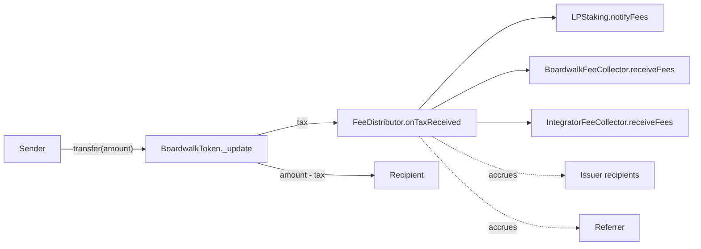
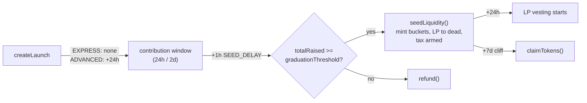
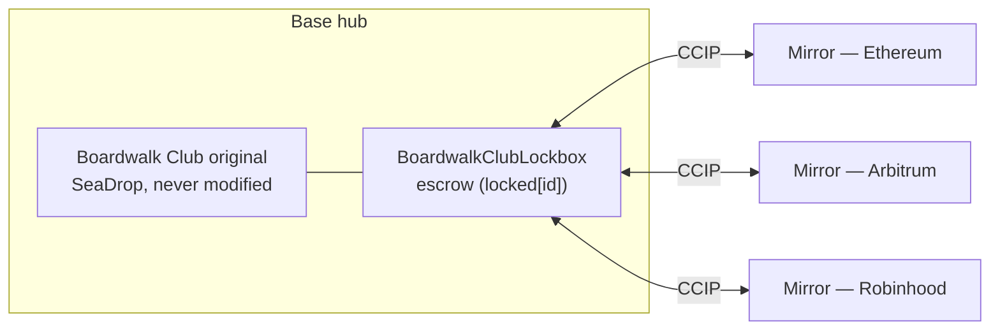
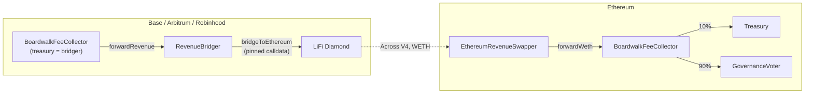
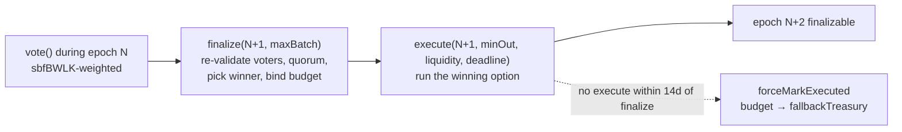

# Boardwalk Launchpad: Technical Spec

A permissionless token launch protocol. Each launch deploys 4–5 EIP-1167 clones from shared implementation templates; singletons are deployed once per chain.

| | |
| --- | --- |
| Protocol token | BWLK — 3.15M fixed supply, home chain Ethereum, replaces BMX via 1:1 migration (see *BWLK token and migration*) |
| Chains | Ethereum (1), Base (8453), Arbitrum (42161), Robinhood Chain (4663) |
| DEX | Canonical Uniswap V2 deployment per chain |
| Raise token | The chain's canonical WETH |
| Swap cost | 0.95% token tax + 0.30% V2 pair fee = **1.25%** |
| Revenue split | 10% treasury / 90% `GovernanceVoter` (Ethereum) |
| Graduation | 2.5 WETH default per launch path (tunable independently) |
| Governance | Weekly revenue votes on Ethereum, sbfBWLK-weighted |

---

## Architecture

**Per-launch clones** (deployed by `LaunchFactory.createLaunch`):
- `BoardwalkToken`: ERC20 with embedded tax
- `FeeDistributor`: splits tax across recipients
- `PresaleManager`: contributions, seeding, claims, refunds
- `LPStaking`: staking with vesting, fee epochs, multiplier points
- `VestingStream`: linear vesting (Advanced path only when `presalePercent < 50%`)

**Singletons** (deployed once per chain):
- `LaunchFactory`, `BoardwalkLPManager`, `BoardwalkFeeCollector`, `IntegratorFeeCollector`, `BoostBurn`
- Ethereum only: `GovernanceVoter`, `LPLocker`, `ParticipationDistributor`, plus the token/migration set (`BWLK`, `BwlkMigration`, `UnsoldBurner`)

Each clone is initialised exactly once. `LPStaking` and `VestingStream` use a two-step `setInitializer` → `initialize` lock so only `PresaleManager` can initialise them at seed time; the rest use OZ `Initializable`. Express launches deploy 4 clones (no `VestingStream`); Advanced launches deploy 5 when `presalePercent < 50%`, otherwise 4.

The per-transfer tax fan-out is the central flow. Sender pays `tax`; the rest goes to the destination:



The LP, boardwalk, and integrator forwards are wrapped in `try/catch` so a downstream revert never bricks the transfer. Issuer and referrer shares accrue for pull-based claims.

---

## Launch paths

|                       | EXPRESS                         | ADVANCED                                                    |
| --------------------- | ------------------------------- | ----------------------------------------------------------- |
| Presale duration      | 24h (configurable, > 0)         | 2d default (admin range 2–14d)                              |
| Presale allocation    | Fixed 50%                       | 25–50%, divisible by 5%                                     |
| Start delay           | None                            | 24h                                                         |
| Graduation threshold  | 2.5 WETH default (admin-tunable) | 2.5 WETH default (admin-tunable)                           |
| Vesting               | Disallowed                      | Up to 5 recipients; required if `presalePercent < 50%`      |
| Referrer              | Disallowed                      | Optional; can be one of the vesting recipients              |
| Issuer fee recipients | 1                               | 1–4                                                         |

Path is frozen in `LaunchInfo`. `LaunchFactory` rejects mixed configs (e.g. Express with vesting reverts).

---

## Token allocation

Total supply is fixed at `TOTAL_SUPPLY = 10_000_000_000e18` for every launch. Splits computed by `AllocationLib.compute(TOTAL_SUPPLY, presalePercent)`:

```
presaleTokens       = TOTAL_SUPPLY * presalePercent / 10_000
liquidityTokens     = presaleTokens
vestingTotal        = TOTAL_SUPPLY - presaleTokens - liquidityTokens
lpIncentiveTokens   = vestingTotal * 20 / 100
issuerVestingTokens = vestingTotal - lpIncentiveTokens
```

Invariant: `presaleTokens + liquidityTokens + lpIncentiveTokens + issuerVestingTokens == TOTAL_SUPPLY`.

LP tokens minted at seed are sent to `0x...dEaD` (permanent liquidity).

---

## Tax mechanism

Universal tax on every non-exempt transfer. Computed in `BoardwalkToken._update`, deducted from the sender, transferred to `FeeDistributor`, then forwarded via the `FeeDistributor.onTaxReceived(amount)` callback. The tax stacks with Uniswap V2's 0.30% pair fee on swaps: 95 BPS tax + 30 BPS pair fee ≈ 1.25% effective. (The pair fee splits 0.25% LP / 0.05% protocol where the V2 fee switch is on — Ethereum/Base/Arbitrum as of July 2026; the full 0.30% goes to LPs on Robinhood, where it is off.)

**Tax rate by phase:**

| Phase | Condition | Rate (BPS) |
| ----- | --------- | ---------- |
| Pre-seed | `liquiditySeedTime == 0` | 0 (only `PresaleManager` can mint) |
| Anti-whale | first `antiWhaleDuration` after seed | `antiWhaleTaxBps - (antiWhaleTaxBps - baseTaxBps) * elapsed / antiWhaleDuration` |
| Steady state | after anti-whale | `baseTaxBps` |

`baseTaxBps`, `antiWhaleTaxBps`, and `antiWhaleDuration` are set at `initialize` and frozen for the life of the token; `baseTaxBps <= antiWhaleTaxBps` is enforced so the decay cannot underflow. Anti-whale is tuned per future launch via `executeSetAntiWhale` within `taxBps ∈ [500, 4000]`, `duration ∈ [5 min, 90 min]`. `liquiditySeedTime` is set exactly once by `PresaleManager.seedLiquidity()`; zero and future timestamps revert.

**Exemption list** (set at `initialize`):

| Address                              | Reason                                                              |
| ------------------------------------ | ------------------------------------------------------------------- |
| `FeeDistributor`                     | Receives tax; exemption prevents recursive tax on the callback path |
| `PresaleManager`                     | Mints initial supply; presale claims after cliff are tax-free       |
| `VestingStream`                      | Vesting claims are tax-free                                         |
| `LPStaking`                          | Reward distribution and fee inflows are tax-free                    |
| `BoardwalkLPManager`                 | Tax-exempt LP add/remove wrapper                                    |
| `BoardwalkFeeCollector`              | Keeper batch-swaps to raise token are tax-free                      |
| `IntegratorFeeCollector` (cond.)     | Receives integrator share via `receiveFees`; per-slot claims are tax-free |

Conditional row applies only when the chain has a non-zero `integratorBps`.

The exempt set is otherwise immutable post-init. The only rotation flow is `FeeDistributor.setFeeCollector` (boardwalk migration), which atomically rotates exemption with the role address and rejects a collector that is already exempt. The chain-level `IntegratorFeeCollector` is immutable; its exempt status cannot be re-pointed.

---

## Fee distribution

The split is frozen per launch at `FeeDistributor.initialize`. Defaults are set at `LaunchFactory` deployment and apply to future launches. One standardized schedule applies on every supported chain:

| Bucket | BPS | Tunable post-deploy | Bound | Routing |
| ------ | --- | ------------------- | ----- | ------- |
| Issuer | 35 | yes (`executeSetFeeDefaults`, future launches only) | 10–80 | Accrues per recipient; pull-claimed as raise token |
| Boardwalk | 35 | yes | 10–50 | Forwarded to `BoardwalkFeeCollector.receiveFees` (try/catch + `pendingBoardwalkFees` retry) |
| LP staking | 15 | yes | ≤ 50 | Forwarded to `LPStaking.notifyFees` (try/catch + `pendingLpFees` retry) |
| Referrer | 5 | yes | ≤ 10, ≤ boardwalk | Advanced-only; carved from boardwalk when a referrer is set (`boardwalkEffective = boardwalk - referrer`), otherwise the slice stays with Boardwalk |
| Integrator | 10 | **no** (`INTEGRATOR_BPS` immutable; changing it requires a new factory) | ≤ 50 | Single bucket forwarded to `IntegratorFeeCollector.receiveFees` (try/catch + `pendingIntegratorFees` retry); split internally per frozen `integratorSplits[]` |
| **Total** | **95** | — | — | Validated: `total == issuer + boardwalk + incentive + INTEGRATOR_BPS` (referrer not additive) |

**Effective splits at launch** (add the 0.30% V2 pair fee on swaps for the 1.25% total):

| Path | Split |
| ---- | ----- |
| **Advanced** (referrer set) | 0.35% issuer, 0.30% Boardwalk, 0.05% referrer, 0.15% LP incentives, 0.10% integrators |
| **Express** (no referrer) | 0.35% issuer, 0.35% Boardwalk, 0.15% LP incentives, 0.10% integrators |

### Integrator slots

Five equal slots, frozen at `IntegratorFeeCollector` construction ([script/FeeSchedules.sol](script/FeeSchedules.sol)). Recipients not yet confirmed for a chain (DefiLlama Research everywhere; SEAL and DeFi Llama off-Ethereum) are pinned to temporary Boardwalk-controlled Safes — distinct per slot, since the collector rejects one address holding two slots. Once each real address is confirmed, the temp Safe signals its rotation (`signalChangeAddress`); after the 14-day delay anyone executes it (`executeChangeAddress(slotIdx, newAddress)`).

| Slot | Integrator | BPS |
| ---- | ---------- | --- |
| 0 | Sherlock | 2 |
| 1 | DefiLlama Research | 2 |
| 2 | 0x | 2 |
| 3 | Security Alliance (SEAL)* | 2 |
| 4 | DeFi Llama* | 2 |

\* public-goods donation.

### Per-transfer routing (`onTaxReceived`)

1. Compute `lp / boardwalk / issuer / referrer / integrator` shares (proportional by frozen BPS).
2. `try`-forward `lp`, `boardwalk`, and `integrator`; each failed forward lands in its `pending*Fees` retry bucket (permissionless `retryPendingFees()` flushes them). `FeeDistributor` grants the integrator collector max allowance at init for its pull pattern.
3. Accrue the issuer share across recipients by frozen splits (last recipient absorbs rounding dust) and increment `referrerAccrued`.

The routing never reverts in aggregate, so a downstream contract cannot brick transfers.

### Claims

| Claim | Caller | Paid in | Rate limit | Dust escape |
| ----- | ------ | ------- | ---------- | ----------- |
| `claimAsRaiseToken(idx, minOut, deadline)` | each issuer recipient | raise token (router swap) | 10% of live unclaimed per recipient per 24h | when 10% rounds to 0, the full unclaimed amount is claimable |
| `claimReferrerFees()` | referrer | launch token | none | — |
| `claim` / `claimBatch` on `IntegratorFeeCollector` | each slot address | raise token (router swap) | 25% of live unclaimed per (slot, token) per 24h | when 25% rounds to 0, the full unclaimed amount is claimable |

- Both rate limits anchor to **live unclaimed** (`totalAccrued - totalClaimed`), never lifetime cumulative, so the cap cannot inflate from history.
- Integrator claim state updates only on successful swap (a failed claim does not consume the window); `claimBatch` isolates per-token failures via `try/catch` + `ClaimFailed` events; `quote` / `quoteBatch` view helpers compute `minAmountsOut[]` from `getAmountsOut`.

### Recipient address changes

Delays in the admin table; claims keep flowing to the OLD address until execute lands.

- **Issuer / referrer** (`FeeDistributor`): only the current recipient can signal/cancel; anyone can execute after the delay.
- **Integrator slots** (`IntegratorFeeCollector`): only the current slot address can signal/cancel; anyone can `executeChangeAddress(slotIdx, newAddress)` after 14 days. Execute rejects zero and addresses held by another slot (storage is slot-keyed; rotation only flips the `address ↔ slot` reverse map).
- **Fee collector** (`FeeDistributor.setFeeCollector`, callable by the current `feeCollector` only): atomically swaps token exemption and approvals; rejects an already-exempt collector. The 7-day delay lives on `BoardwalkFeeCollector.MIGRATE_COLLECTOR`.

`FeeDistributor` and `IntegratorFeeCollector` both seal the generic `signalAction` path (`_authAdmin` reverts); only the typed flows above mutate state.

---

## Presale



1. `contribute(amount)` during the window. Each contribution gets a time-decayed bonus multiplier `11_000 → 10_000` (10% at open, 0% at close): `weightedAmount = amount * bonus / 10_000`. Per-user and global raw/weighted totals are tracked for O(1) claims.
2. After `presaleEnd + 1h`, `seedLiquidity()` is permissionless. At or above threshold it mints all buckets (`AllocationLib.compute`), transfers token + raise token to the V2 pair, calls `pair.mint(DEAD_ADDRESS)` (LP unrecoverable), initialises `LPStaking` (and `VestingStream` if applicable), and sets `liquiditySeedTime` — anti-whale starts counting down.
3. After `seedTime + 7d`, `claimTokens()` pays `user.weightedContributed * presaleTokens / totalWeightedRaise`.
4. Below threshold, `refund()` returns each user's `totalContributed`.

`setVestingConfig` is called by `LaunchFactory` exactly once for Advanced launches. Only `PresaleManager` can call `token.mint(...)`, bounded by `TOTAL_SUPPLY`. Graduation thresholds default to 2.5 WETH per path (deploy env, tunable via timelocked `executeSetGraduation` for future launches). The two paths are separate values and can hold different thresholds.

---

## LP staking

`LPStaking` has zero admin functions; fully immutable after `initialize`. Two reward streams flow into a single weight-based accumulator (1e30 precision):

```
// vesting: 3-year linear from vestingStart = seedTime + 24h
vestingDelta = elapsed * vestingAllocation / VESTING_DURATION

// fees: weekly epochs, rate fixed per epoch
feeDelta     = elapsed * currentEpochFees / 7 days

accRewardPerWeight += (vestingDelta + feeDelta) * 1e30 / totalWeight
pending(user)       = user.weight * accRewardPerWeight / 1e30 - user.rewardDebt
```

**Epochs** advance lazily inside `_updateAllRewards()` (called by every `stake / withdraw / claim / notifyFees`). On rollover: `currentEpochFees ← pendingEpochFees`, rate recomputed, and `currentEpochStart ← block.timestamp` — anchored to the trigger, not the boundary, so every epoch streams a full 7 days even when triggers are late. Fees accrued during epoch N stream during epoch N+1 pro-rata against live `totalWeight`; capturing the full epoch-N bucket requires staying staked through N+1's streaming window (intentional smoothing). `notifyFees` fires on every taxed transfer; both endpoints are tax-exempt, so the callback cannot re-enter `_update` and `nonReentrant` is omitted on this path.

**Multiplier points** accrue at `1 MP per LP per year`, lazily crystallised on user interactions:

```
newMp       = user.lpStaked * elapsed / 365 days
user.weight = user.lpStaked + user.multiplierPoints
mpToBurn    = user.multiplierPoints * withdrawAmt / user.lpStaked   // proportional burn on withdraw
```

- **Pending reward ordering**: pending is settled with the OLD weight before MP updates, so an MP delta cannot inflate already-earned rewards.
- **Zero-staker fee notifications**: with `totalWeight == 0` the inbound amount is burned to `DEAD_ADDRESS` (`FeesLost` emitted) so a first staker after dormancy cannot harvest earlier fees. The FD-side `try` still succeeds — `pendingLpFees` is NOT incremented.
- **Zero-staker accrual**: vesting/fee accrual during zero-staker windows is permanently lost; `lastRewardUpdate` advances without distribution.

---

## Vesting

`VestingStream` is per-launch (Advanced only), up to 5 recipients, immutable after `initialize` except recipient addresses:

```
cliffEnd     = seedTime + 7 days
vestingEnd   = cliffEnd  + 3 years
claimable(i) = (block.timestamp - cliffEnd) * allocations[i].amount / 3 years - allocations[i].claimed
```

Claims revert before `cliffEnd`. Recipient changes are issuer-signalled (generic `signalAction`, `_authAdmin == issuer`); after 7 days anyone executes the typed `executeChangeRecipientAddress`, which auto-claims vested-but-unclaimed tokens for the outgoing recipient first. Per-allocation burn makes an address permanently immutable. `VestingStream` is tax-exempt, so claims pay no tax.

---

## Cross-contract flows

### 1. Launch creation (`LaunchFactory.createLaunch`)

1. Validate config (path rules, presale percent, splits sums, zero-address checks, distinct-address invariant against the immutable exempt singletons).
2. Burn `_effectiveCost(bwlkBurnAmount, memberLaunchDiscountBps, issuer)` BWLK from the issuer to dead.
3. Deploy clones; lock `LPStaking` / `VestingStream` initializers to the presale.
4. Initialise token (tax params + exempt list), feeDistributor (recipients + all five bucket BPS, with the referrer carve-out applied), presale (duration, percent, graduation threshold, delay flag).
5. For Advanced with vesting: `presale.setVestingConfig(recipients, amounts)`.
6. Store `LaunchInfo`, emit `LaunchCreated` (labels for indexers).

### 2. Transfer → tax → distribution

1. `BoardwalkToken._update` checks both endpoints against `isExempt`, computes the phase tax, and transfers it to `FeeDistributor`.
2. `onTaxReceived` splits and routes per *Fee distribution* above.
3. LP share: `notifyFees` streams it into the epoch machinery (or burns it during zero-staker windows). Boardwalk share: accumulates in the collector. Integrator share: pulled and allocated across slots.

### 3. Stake / withdraw / claim (`LPStaking`)

- **Stake**: `_updateAllRewards()` → settle pending with OLD weight → update MP → pull LP → update `lpStaked`, `totalWeight`, `rewardDebt`.
- **Withdraw**: same prefix → burn MP proportionally → decrement balances → new `rewardDebt` → push LP.
- **Claim**: `_updateAllRewards()` → pending with stored weight → push reward → update MP → recalc debt.

### 4. Keeper batch swap (`BoardwalkFeeCollector`)

1. Keeper calls `swapToRaiseToken(tokens[], minAmountsOut[], deadline)`; for bridge-only revenue with nothing to swap, `forwardRevenue()` (no-op on zero balance).
2. Per token: lazy max-approve the router if undersized, swap, clear `accumulatedFees[token]`. `RAISE_TOKEN` entries are skipped.
3. Forward the full raise-token balance (swap output plus any bridged/residual balance) to `treasury` — or split 10/90 with `GovernanceVoter` where the vault is set (Ethereum).

---

## Cross-chain membership (NFT bridge)

The Boardwalk Club collection (SeaDrop on Base, immutable, 224 fixed supply, ids 1–224) bridges over Chainlink CCIP, hub-and-spoke with Base as the hub:



- **Lockbox (Base)**: escrows originals (`locked[id]` set before the pull) and sends a 64-byte `(recipient, tokenId)` message to the destination mirror; inbound peer messages release escrow. Release requires `locked[id]` — a peer can only release what `bridge` escrowed.
- **Mirrors (spokes)**: standard transferable ERC721s reproducing the original's name/symbol/ids/URIs; mint on inbound, burn to bridge back. Only peer is the Base lockbox, pinned at the type level (`OnlyBaseSelector`); spoke→spoke is two hops via Base. Each spoke's `nftCollection` gate points at its mirror; the deprecated soulbound `BoardwalkClub` stays deployed but no longer gates.
- **Invariant**: per token id, exactly one live representation — the original with a holder, or (while `locked`) exactly one spoke mirror.
- **Fees**: `bridge(destinationChainSelector, tokenId, recipient)` is `payable` (documented carve-out). Caller pays the CCIP fee in native, quoted via `quoteBridge`; exactly the quote is forwarded, excess refunded last. Bridging is token-owner-only (approvals not honored).
- **New spokes**: the lockbox's one-shot `initializePeers` is consumed; new mirrors are wired via the typed `SET_PEER` timelock ([script/05_AddLockboxPeer.s.sol](script/05_AddLockboxPeer.s.sol)): signal → 7d → execute → canary round-trip before announcement.

### Delivery failure modes

| Outcome | What happens | Recovery |
| ------- | ------------ | -------- |
| Destination revert | Message parks in CCIP's FAILED state | Permissionless manual re-execution with more gas. **Never** `FORCE_UNLOCK` these — the message stays replayable, and a later replay double-mints |
| Vacuous SUCCESS (peer has no code, or fails the ERC165 check) | Delivery marked successful, nothing minted; not retryable | `FORCE_UNLOCK` (30d) — this is why wiring is timelocked and every lane gets a pre-launch canary |
| Deprecated lane | Escrowed originals stranded | `FORCE_UNLOCK` (30d) |

`FORCE_UNLOCK(tokenId, to)` is the sole path that releases a `locked` original:

- Takes an explicit recipient — the rightful claimant may be a spoke secondary buyer, unknowable on Base — verified off-chain and committed at signal time.
- Signaling requires the token escrowed (no pre-arming the clock); the 30-day public `ChangeSignaled` window is the adjudication mechanism, and a live holder defeats a wrongful signal outright by bridging back (release cancels it).
- Lane changes must drain in-flight messages first: `removePeer` the outgoing side, wait out deliveries, then execute.

---

## Cross-chain revenue bridging

Each source chain's `BoardwalkFeeCollector` accrues revenue in WETH. Weekly, an automated keeper consolidates it to Ethereum, where the 10/90 treasury/governance split applies. Revenue moves only through onchain bridging contracts the keeper triggers:



- **`RevenueBridger`** (one per source lane): holds the raise token (it is the source collector's `treasury`). The bridge keeper calls `bridgeToEthereum(amount, lifiCalldata)`, forwarding keeper-built LiFi route calldata to the per-chain Diamond. Every lane is a pure Across V4 WETH route (`msg.value == 0`); composed (source-swap) lane support and the payable/native-fee path are retained for future non-WETH raise tokens but unused.
- **`EthereumRevenueSwapper`** (hub): delivery target for all lanes; rescue-capable, so a wrongly-delivered asset is recoverable (at the rescue-less FeeCollector it would be stuck). `swapAndForward` swaps a non-WETH `tokenIn` → WETH via the 0x AllowanceHolder; permissionless `forwardWeth()` is the standard sweep for the all-WETH lane set. Only its WETH output ever reaches the FeeCollector.

Per-chain config in [script/CrossChainConfig.sol](script/CrossChainConfig.sol); deploy via [script/06_DeployRevenueBridging.s.sol](script/06_DeployRevenueBridging.s.sol) — Ethereum swapper first, then each lane pinned to it as `ETHEREUM_DESTINATION`.

### Security controls (`RevenueBridger.bridgeToEthereum`)

Bridge-keeper-gated, `nonReentrant`. Three layers:

1. **Target + selector allowlist** — call target is the immutable Diamond; `bytes4(lifiCalldata)` must be allowlisted (timelocked `SET_SELECTOR`; one shape per lane, matching `HAS_SOURCE_SWAPS`).
2. **Calldata pinning** — `abi.decode(lifiCalldata[4:], ...)` (mirrors LiFi's own `CalldataVerificationFacet`):

   | Field | Pinned to |
   | ----- | --------- |
   | `BridgeData.receiver` / `AcrossV4Data.receiverAddress` | the `EthereumRevenueSwapper` |
   | `BridgeData.destinationChainId` | 1 |
   | `BridgeData.hasDestinationCall` | `false` |
   | `BridgeData.hasSourceSwaps` | the lane's frozen `HAS_SOURCE_SWAPS` (wrong-shape calldata self-reverts) |
   | `BridgeData.sendingAssetId` / `minAmount` | raise token / `amount` |
   | `AcrossV4Data.refundAddress` | the bridger — load-bearing: closes the forced-expiry self-refund that would otherwise reclaim the full input on origin |
   | `AcrossV4Data.sendingAssetId` / `receivingAssetId` | raise token / Ethereum WETH |
   | `AcrossV4Data.outputAmount` | `>= amount * (10000 - MAX_FEE_BPS) / 10000` |

   On composed lanes (retained shape, no current lane) only the `requiresDeposit` legs are pinned (`sendingAssetId == raise token`, summed `fromAmount == amount`) — never the post-swap `BridgeData` fields.
3. **Exact approval + balance delta** — approve the Diamond for exactly `amount`, call, reset to 0, assert the balance dropped by at most `amount`.

### Trust model

| Leg | Trust | Bound |
| --- | ----- | ----- |
| Source lanes (Base / Arbitrum / Robinhood) | Delivery pinned onchain (Across V4 facet-data) | Residual = `MAX_FEE_BPS` relayer spread + LiFi-Diamond upgrade risk, against the standing balance only |
| Ethereum swap leg (`swapAndForward`) | Keeper-trusted (`tokenIn` + 0x calldata + `minOut`) | `minOut`; `tokenIn != WETH` so keeper calldata can never pull bridged WETH; output always WETH to the immutable `FEE_COLLECTOR` |

Emergency response = `revokeKeeper` + halt the accrual cron (both instant); keeper replacement is then a 7-day timelock.

### Invariants

- **Source `governanceVault == address(0)` forever** (Base, Arbitrum, Robinhood): a set vault diverts 90% of `forwardRevenue` past the bridger. Never call `executeSetGovernanceVault` there; alert on `GovernanceVaultUpdated`. Ethereum is the governance home — its collector's vault points at the BWLK `GovernanceVoter` (the one legitimate `GovernanceVaultUpdated`), and Ethereum has no lane (the lane config reverts for chainId 1, regression-tested).
- **Nothing but WETH addressed to the Ethereum FeeCollector** (it has no rescue). Structural: all lanes deliver to the rescue-capable swapper, and only its WETH ever reaches the FeeCollector.

---

## BWLK token and migration

BMX migrates 1:1 to BWLK; Ethereum mainnet is the protocol's governance and revenue home. Three contracts in `src/token/`, all Ethereum-only.

**BWLK** ([src/token/BWLK.sol](src/token/BWLK.sol)): fixed-supply ERC20, minted once at deployment. No minter, owner, or pause. Cross-chain via Chainlink CCT — LockReleaseTokenPool on Ethereum, BurnMint representations on the other chains (used for launch burns and Boost/Deboost) — so the token itself never mints or burns; `getCCIPAdmin()` exists only for registry registration.

| Bucket | BWLK | Share |
| ------ | ---- | ----- |
| Migration pool (1:1 for BMX) | 2,711,068 | 86.07% |
| CCA auction | 157,500 | 5% |
| LP seed | 157,500 | 5% |
| LP incentives escrow (1-year program) | 123,932 | 3.93% |
| **Total** | **3,150,000** | 100% |

**Migration** ([src/token/BwlkMigration.sol](src/token/BwlkMigration.sol)): one-way, permissionless, once per source address, all-or-nothing. `migrate(destination, snapshotBmx, snapshotPoints, proof)` reads the caller's entire BMX balance, sends it to dead, and stakes an equal amount of BWLK for `destination` through the three reward trackers. Every migrator earns a voter-point credit of 16% of the migrated amount (minted as bnBWLK into the fee tracker); a merkle leaf exists only to carry a prior Base staker's points, scaled by how much of the staked position they bring back:

```
points = brought * 16%
       + snapshotPoints * 116% * min(brought, snapshotBmx) / snapshotBmx   // stakers only
```

- The root is one-shot (`setMerkleRoot`); post-publication corrections go through owner-only `creditPoints` (adds points, no path to BWLK).
- `migrate` reverts during voter finalization and after `CLAIM_DEADLINE`; past the deadline the owner sweeps the unclaimed pool.
- Payouts are 1:1 against a fixed pre-funded pool — an underfunded pool reverts rather than short-pays.
- The snapshot is built by [snapshot/](snapshot/) (stakers-only leaves; exclusions are an explicit allowlist, contract-held stakes migrate too; validated against tracker `totalDepositSupply` before publishing).

**Launch** ([src/token/UnsoldBurner.sol](src/token/UnsoldBurner.sol) + [script/bwlk/06_LaunchBwlkCca.s.sol](script/bwlk/06_LaunchBwlkCca.s.sol)): the 315,000 market-formation bucket launched through Uniswap's LiquidityLauncher + LBPStrategy (continuous clearing auction, native ETH raise) — never the raw CCA factory, whose auctions the strategy cannot sweep. This launch has no graduation threshold (`isGraduated()` true from creation, explicitly attested). `UnsoldBurner` is the auction's `tokensRecipient`: no admin, BWLK can only leave to dead, anyone calls `sweep(auction)` after close. LP positions mint to `LPLocker`; the registrar registers each (`registerPosition`, full pool key pinned to the voter's) and renounces. The pool's hook is only knowable post-launch, so `GovernanceVoter.POOL_HOOKS` is one-shot settable (`setPoolHooks`, open only when deployed unset) and `execute()` blocks options 2/3/4 until committed.

Deploy scripts in [script/bwlk/](script/bwlk/): `01` token, `02` governance, `03` migrator (root before funding), `05` burner, `06` CCA launch (Permit2 funding + one `multicall`; prints the CREATE2-predicted auction address). `04_AssertBwlkDeploy.s.sol` is the go-live gate: `assertAll` reverts unless the full wiring holds (pool funded + root set, tracker wiring, gov custody, claim window, post-launch one-shots).

---

## Contract reference

| Contract | Type | Source | Auth model |
| -------- | ---- | ------ | ---------- |
| `BoardwalkToken` | clone | [src/core/BoardwalkToken.sol](src/core/BoardwalkToken.sol) | No owner; `feeDistributor` may rotate own exempt flag |
| `FeeDistributor` | clone | [src/core/FeeDistributor.sol](src/core/FeeDistributor.sol) | `Timelocked`; generic admin disabled; only the current issuer / referrer can rotate their own slot |
| `PresaleManager` | clone | [src/core/PresaleManager.sol](src/core/PresaleManager.sol) | No admin; `setVestingConfig` is one-shot factory-only |
| `LPStaking` | clone | [src/core/LPStaking.sol](src/core/LPStaking.sol) | No admin; two-step initializer lock |
| `VestingStream` | clone | [src/core/VestingStream.sol](src/core/VestingStream.sol) | `Timelocked`; `_authAdmin == issuer`; two-step initializer lock |
| `LaunchFactory` | singleton | [src/core/LaunchFactory.sol](src/core/LaunchFactory.sol) | `Ownable2Step + Timelocked + MembershipDiscount`; owner-controlled |
| `BoardwalkLPManager` | singleton | [src/core/BoardwalkLPManager.sol](src/core/BoardwalkLPManager.sol) | No admin; immutable; restricted to pairs containing `RAISE_TOKEN` |
| `BoardwalkFeeCollector` | singleton | [src/core/BoardwalkFeeCollector.sol](src/core/BoardwalkFeeCollector.sol) | `Ownable2Step + Timelocked` |
| `IntegratorFeeCollector` | singleton (per chain) | [src/core/IntegratorFeeCollector.sol](src/core/IntegratorFeeCollector.sol) | `Ownable2Step + Timelocked`; the only `onlyOwner` function is one-shot `setFactory`; each slot rotates its own address |
| `BoostBurn` | singleton | [src/core/BoostBurn.sol](src/core/BoostBurn.sol) | `Ownable2Step + Timelocked + MembershipDiscount` |
| `BWLK` (Ethereum) | singleton | [src/token/BWLK.sol](src/token/BWLK.sol) | No owner, minter, or pause; fixed supply |
| `BwlkMigration` (Ethereum) | singleton | [src/token/BwlkMigration.sol](src/token/BwlkMigration.sol) | `Ownable2Step` (owner = 21-day governance timelock); one-shot `setMerkleRoot`; not `Timelocked` |
| `UnsoldBurner` (Ethereum) | singleton | [src/token/UnsoldBurner.sol](src/token/UnsoldBurner.sol) | No admin; BWLK can only move to dead |
| `BoardwalkClubLockbox` (Base) | singleton | [src/nft/BoardwalkClubLockbox.sol](src/nft/BoardwalkClubLockbox.sol) | `Ownable2Step + Timelocked`; generic admin + burn disabled; one-shot `initializePeers`; instant `removePeer` kill switch |
| `BoardwalkClubMirror` (spokes) | singleton (per spoke) | [src/nft/BoardwalkClubMirror.sol](src/nft/BoardwalkClubMirror.sol) | `Ownable2Step + Timelocked`; peer pinned to the Base selector; instant `removePeer` kill switch |
| `BoardwalkClubBridgeBase` | base | [src/nft/BoardwalkClubBridgeBase.sol](src/nft/BoardwalkClubBridgeBase.sol) | CCIP peer registry + send/receive plumbing; typed timelocked `SET_PEER` |
| `RevenueBridger` | singleton (every source lane) | [src/crosschain/RevenueBridger.sol](src/crosschain/RevenueBridger.sol) | `Ownable2Step + Timelocked + ReentrancyGuardTransient`; generic admin + burn disabled; typed `SET_KEEPER` / `SET_SELECTOR` / `RESCUE`; payable carve-out (native route fee via `msg.value`, excess refunded; unconditional `receive()`); instant `revokeKeeper` kill switch |
| `EthereumRevenueSwapper` | singleton (Ethereum) | [src/crosschain/EthereumRevenueSwapper.sol](src/crosschain/EthereumRevenueSwapper.sol) | as `RevenueBridger` (non-payable); typed `SET_KEEPER` / `RESCUE`; permissionless `nonReentrant` `forwardWeth`; `tokenIn != WETH` swap guard |
| `Timelocked` | base | [src/base/Timelocked.sol](src/base/Timelocked.sol) | Generic signal/execute/burn pattern; per-action delay via `_actionDelay` virtual hook |
| `MembershipDiscount` | base | [src/base/MembershipDiscount.sol](src/base/MembershipDiscount.sol) | NFT membership check + BPS discount helpers |
| `GovernanceVoter` (Ethereum) | singleton | [src/governance/GovernanceVoter.sol](src/governance/GovernanceVoter.sol) | `Ownable2Step + Timelocked`; keeper-or-owner for finalize/execute; one-shot owner `setPoolHooks` |
| `LPLocker` (Ethereum) | singleton | [src/governance/LPLocker.sol](src/governance/LPLocker.sol) | `lockPosition` only callable by `GovernanceVoter`; renounceable launch registrar for `registerPosition`; no `onERC721Received` |
| `ParticipationDistributor` (Ethereum) | singleton | [src/governance/ParticipationDistributor.sol](src/governance/ParticipationDistributor.sol) | `createStream` only callable by `GovernanceVoter` |

---

## Admin and timelocks

All admin actions go through `Timelocked.signalAction(action, dataHash) → typed execute*(...)` after the delay (7 days default; 7-day expiry window after the delay). Owners can `cancelAction` before execute; anyone can execute once delayed. Owner-controlled actions can be permanently burned via `signalBurnAction / executeBurnAction`.

| Contract | Action | Delay | Constraints |
| -------- | ------ | ----- | ----------- |
| LaunchFactory | `SET_BWLK_BURN` | 7d | ≤ 200e18 (the launch cost, burned in BWLK); burnable |
| LaunchFactory | `SET_GRADUATION_EXPRESS / _ADVANCED` | 7d | > 0 |
| LaunchFactory | `SET_EXPRESS_DURATION` | 7d | > 0 |
| LaunchFactory | `SET_ADVANCED_DURATION` | 7d | 2–14 days |
| LaunchFactory | `SET_FEE_DEFAULTS` | 7d | bucket bounds per *Fee distribution*; tunes the four mutable buckets only; new `total` MUST equal `issuer + boardwalk + incentive + INTEGRATOR_BPS`; future launches only |
| LaunchFactory | `SET_ANTI_WHALE` | 7d | tax 500–4000 BPS, duration 5–90 min; future launches only |
| LaunchFactory | `SET_PRESALE_RANGE` | 7d | 500–5000 BPS, divisible by 500 |
| LaunchFactory | `SET_FEE_COLLECTOR` | 7d | non-zero, distinct from `INTEGRATOR_COLLECTOR` and `BOARDWALK_LP_MANAGER`; future launches only |
| LaunchFactory | `SET_NFT_COLLECTION` | 7d | `address(0)` disables discounts |
| LaunchFactory | `SET_MEMBER_LAUNCH_DISCOUNT` | 7d | ≤ 10000 BPS |
| BoardwalkFeeCollector | `SET_TREASURY / _KEEPER` | 7d | non-zero |
| BoardwalkFeeCollector | `SET_GOVERNANCE_VAULT` | 7d | may be zero (disables governance split); non-zero enforces `IGovernanceVoter(vault).WETH() == RAISE_TOKEN` |
| BoardwalkFeeCollector | `MIGRATE_COLLECTOR` | 7d | non-zero `newCollector`; both args committed in hash |
| BoostBurn | `SET_BWLK_COST` | 7d | 0–1 BWLK |
| BoostBurn | `SET_NFT_COLLECTION / _MEMBER_BOOST_DISCOUNT` | 7d | as LaunchFactory analogues |
| FeeDistributor | `CHANGE_ISSUER(idx) / CHANGE_REFERRER` | 7d | per-recipient self-signal; non-zero in execute; not burnable |
| IntegratorFeeCollector | `CHANGE_ADDRESS(slotIdx)` | **14d** | per-slot self-signal; execute permissionless; rejects zero and addresses held by another slot; not burnable |
| VestingStream | `CHANGE_RECIPIENT(idx)` | 7d | issuer-signal; non-zero; auto-claims for outgoing; per-allocation burnable |
| BoardwalkClubLockbox / Mirror | `SET_PEER(selector)` | 7d | typed signal only (generic admin + burn disabled); execute permissionless; rejects zero peer; mirror restricted to the Base selector; instant owner `removePeer` is the kill switch |
| BoardwalkClubLockbox | `RESCUE(collection, tokenId)` | 7d | recipient committed in hash; execute permissionless; hard-reverts on escrow-accounted (`locked`) originals |
| BoardwalkClubLockbox | `FORCE_UNLOCK(tokenId)` | **30d** | recipient committed in hash; requires the token escrowed at signal; execute permissionless; sole `locked`-release path — vacuous-SUCCESS deliveries and deprecated lanes only, never FAILED-replayable messages (see *NFT bridge*) |
| GovernanceVoter | `SET_TREASURY / _KEEPER` | 7d | non-zero |
| GovernanceVoter | `SET_FEE_COLLECTOR` | 7d | non-zero; pair with `BoardwalkFeeCollector.MIGRATE_COLLECTOR` |
| GovernanceVoter | `SET_GOVERNANCE_BURN` | **21d** | 0–1 BWLK |
| GovernanceVoter | `SET_FALLBACK_TREASURY` | **21d** | non-zero; setter itself burnable |
| GovernanceVoter | `setPoolHooks` | none (one-shot) | owner-only, outside `Timelocked`; open only when deployed with `poolHooks == 0`; `execute()` blocks options 2/3/4 until committed |
| RevenueBridger / EthereumRevenueSwapper | `SET_KEEPER` | 7d | non-zero; instant owner `revokeKeeper` is the kill switch (documented exception to the all-admin-Timelocked rule, precedent: lockbox `removePeer`) |
| RevenueBridger | `SET_SELECTOR(selector)` | 7d | add/remove a LiFi facet selector; one shape per lane matching `HAS_SOURCE_SWAPS` |
| RevenueBridger / EthereumRevenueSwapper | `RESCUE(token)` | 7d | `token == address(0)` rescues native, else the ERC20; recipient + amount committed in hash; execute permissionless |

`BoardwalkToken`, `LPStaking`, `PresaleManager`, `BoardwalkLPManager`, and `ParticipationDistributor` have no admin functions. `LPLocker`'s only privileged role is the launch registrar, renounced after the CCA position is registered. `BwlkMigration` is plain `Ownable2Step` (owner = the 21-day timelock): one-shot `setMerkleRoot`, points-only `creditPoints`, and deadline-gated `sweepUnclaimed`.

---

## Governance (Ethereum)

`GovernanceVoter` is a merged voter + executor + vault, funded by the collector's 90% share (`governanceVault == address(0)` routes 100% to treasury instead). Peers (`lpLocker`, `participationDistributor`, `feeCollector`) are wired once via `initializePeers` and validated bidirectionally; the `feeCollector` is the sole address authorised to call `depositRevenue`. Deploy order: `GovernanceVoter` → `LPLocker(voter)` → `ParticipationDistributor(voter)` → `initializePeers`.

Voting weight comes from the BWLK staking trackers (sbfBWLK balances, bnBWLK multiplier points). `executeSetGovernanceVault(vault)` enforces `IGovernanceVoter(vault).WETH() == RAISE_TOKEN` for any non-zero vault — the wiring is only valid where the raise token is WETH.

### Weekly cycle

Votes in epoch `N` decide the winner of epoch `N+1`; epoch 0 defaults to treasury. Epoch `N` cannot finalize until `N-1` is both finalized AND executed.



1. **`vote(option)`**: weighted by `sbfBWLK.balanceOf` at vote time. Requires `stakedMP >= stakedBWLK * 1.5%` (participation gate). Optional per-vote BWLK burn (`governanceBurn`, 0–1 BWLK, starts at 0). Reverts during finalization.
2. **`finalize(epoch, maxBatch)`** (keeper-or-owner): re-validates the prior epoch's voters in batches — re-reads live sbfBWLK balances and reduces option weights for voters whose balance dropped (never inflates). When complete: applies quorum + the consecutive-win cap, picks the winner, binds `budget = epochRevenue[epoch]` (the WETH deposited via `depositRevenue` while that epoch was current).
3. **`execute(epoch, amountOutMin, liquidity, deadline)`** (keeper-or-owner): runs the winner with caller-supplied slippage; `liquidity` is Option-3-only. Decrements `accountedBudget`.
4. **`forceMarkExecuted(epoch)`** (permissionless, 14d after `finalizedAt[epoch]`): routes the budget to `fallbackTreasury`. Deadlock resolver only.

### Quorum and winner selection

- `quorumBase = max(snapshotTotalWeight, live sbfBWLK.totalSupply() at finalize)` — a pre-snapshot supply deflation cannot lower quorum below live supply.
- Quorum: `eligibleVoteWeight >= quorumBase * 51%`, where `eligibleVoteWeight` excludes votes for options that are ineligible at finalize time.
- **Consecutive-win cap**: an option winning 3 consecutive epochs is ineligible for the next epoch, then eligible again.
- Zero supply / zero eligible weight fails quorum safely; no quorum or no eligible winner → treasury.

### Vote options

| Option | Action |
| ------ | ------ |
| 1. Treasury | Send the WETH budget to `treasury` |
| 2. Buy & Burn BWLK | Swap to BWLK via Universal Router (v4, native ETH), burn to dead |
| 3. Buy & Burn LP | Swap half to BWLK, mint a full-range Uniswap v4 ETH/BWLK LP position, lock it in `LPLocker` (mechanics below) |
| 4. Participation | Swap to BWLK, stream over 7 days to the prior epoch's voters via `ParticipationDistributor` |

Options 2/3/4 trade through the pool key built from `POOL_FEE / POOL_TICK_SPACING / POOL_HOOKS`; `execute()` reverts `PoolHooksNotSet` for all three until the one-shot `setPoolHooks` commits the hook.

**Option 3 mechanics**: split the budget 50/50; swap half to BWLK (`V4_SWAP`); pre-fund BWLK to the PositionManager and call `modifyLiquidities()` directly with `MINT_POSITION + SETTLE(ETH) + SETTLE(BWLK) + SWEEP(ETH→voter) + SWEEP(BWLK→voter)`, tick bounds `TickMath.{min,max}UsableTick(POOL_TICK_SPACING)`, NFT to `LPLocker` (then `lockPosition`). Residual BWLK → dead; residual ETH re-wrapped → treasury. Caller supplies `liquidity` and slippage.

**Native ETH (v4)**: v4 pools use native ETH (`address(0)` = currency0). The voter unwraps WETH before swaps/mints and sends ETH via `msg.value`; `receive()` accepts ETH from WETH and the PositionManager only.

### Batch-finalization invariants

- `finalizationInProgress` blocks `vote()` (no balance inflation mid-tally).
- `validationCursor[epoch]` advances per batch; `finalizingEpoch` prevents bleed-over to the next epoch.
- `accountedBudget` (finalized-but-not-executed sum) is never derived from `balanceOf`, so direct WETH transfers cannot skew accounting.

### Supporting contracts

- **LPLocker**: permanent holder of v4 LP NFTs. Two registration paths: `lockPosition` (voter-only, after an Option 3 mint) and registrar-gated `registerPosition` for the CCA launch positions (locker must own the NFT, hook committed, full pool key matches the voter's; registrar renounces after launch). No `onERC721Received`, so external `safeTransferFrom` reverts. `claimFees` / `claimAllFees` harvest via `DECREASE_LIQUIDITY(0) + TAKE_PAIR`; the ETH share goes natively to `GovernanceVoter.treasury()` (read live).
- **ParticipationDistributor**: pull-based 7-day linear BWLK streams per epoch; prior-epoch voters `claim(epoch)` their proportional share; `claimAll(epochs[])` reverts only if nothing is claimable across the whole batch.

### Collector migration choreography

`executeMigrateCollector` retargets all FeeDistributors to a new collector. Constraints driving the ordering: `depositRevenue` only accepts the voter's bound `feeCollector` and has no try/catch — a collector whose vault points at a voter that does not recognise it bricks its own swap path; and an old collector with a stale vault reverts the same way once the voter rotates away.

Four timelocked signals, all 7-day delay, signed together:

1. **New collector** — `SET_GOVERNANCE_VAULT(voter)`. Execute only AFTER step 4 executes.
2. **Old collector** — `SET_GOVERNANCE_VAULT(address(0))`, so its residual drains 100% to treasury.
3. **Old collector** — `MIGRATE_COLLECTOR(newCollector, distributors)`, switching every FD.
4. **Voter** — `SET_FEE_COLLECTOR(newCollector)`, rotating the sole `depositRevenue` caller.

The same ordering applies to a fresh-deployment cutover (no launches on the old stack): deploy the new collector vault-unset, signal 1 and 4 together, execute the voter rotation first.

### Deployment caveats

The live deployment targets Ethereum mainnet's canonical v4 `UniversalRouter` (`0x66a9893cC07D91D95644AEDD05D03f95e1dBA8Af`), and `_swapRaiseTokenForBwlk` encodes the `V4_SWAP` path with the `0x140`-length `ExactInputSingleParams` layout used by that router revision. Overriding `UNIVERSAL_ROUTER` to a newer revision (some newer UR builds expect an extra `minHopPriceX36` field) MUST update `_swapRaiseTokenForBwlk`'s calldata accordingly, or swaps will silently revert.
